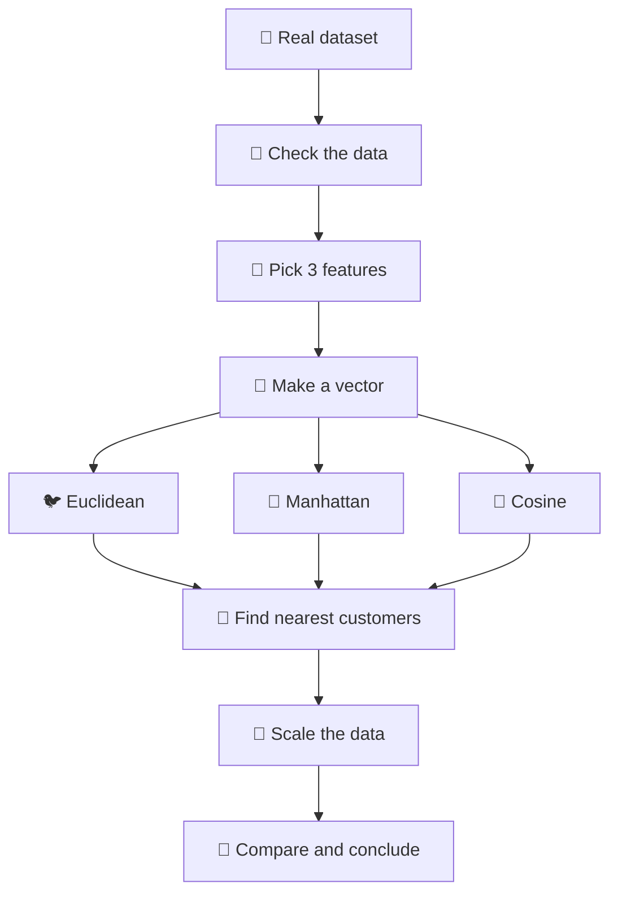
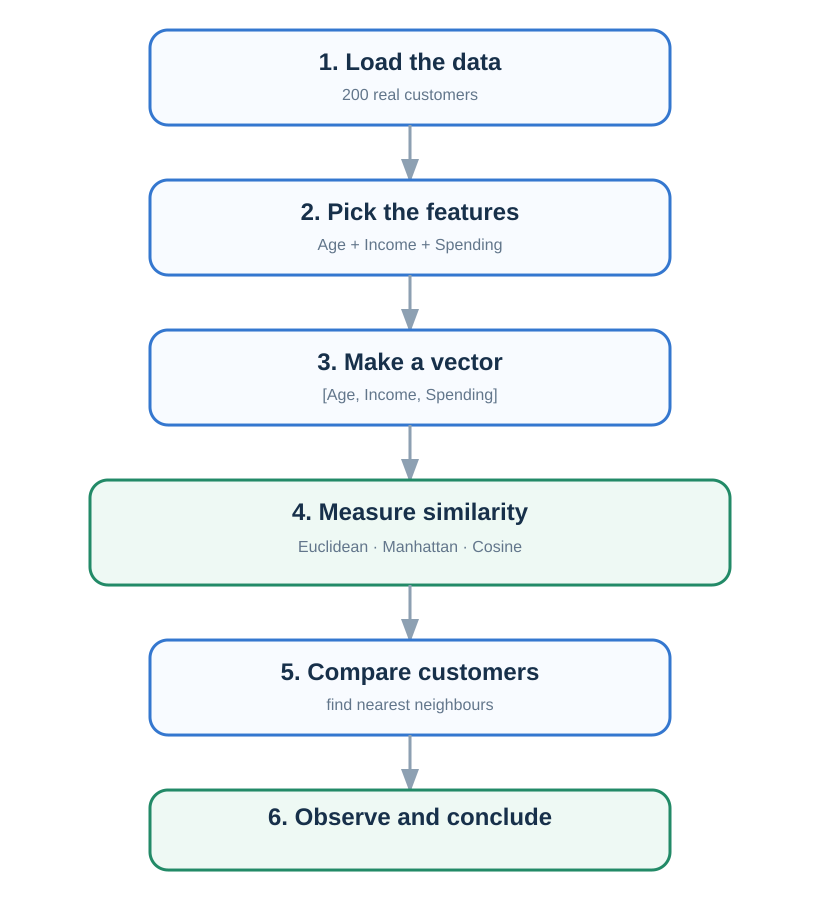
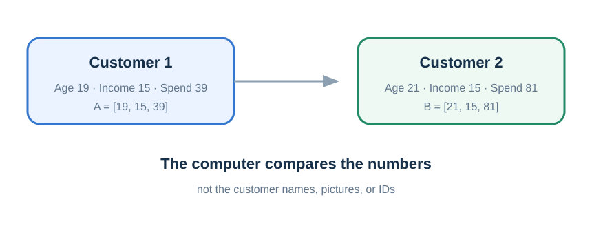
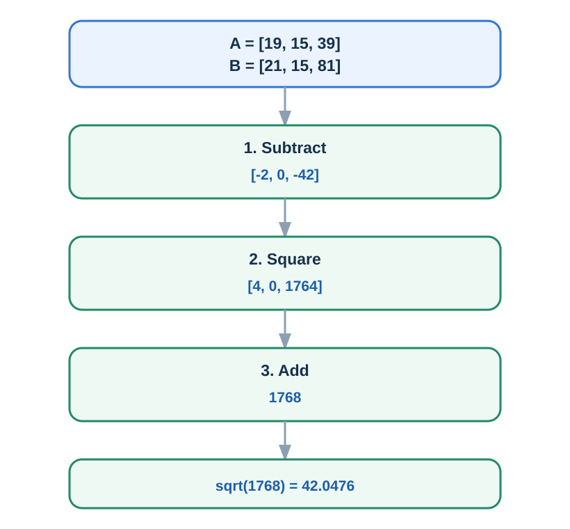

# INT396 Practical 1 — Customer Similarity

**Goal:** Use the real `mall_customers.csv` file to understand how a computer measures similarity between customers.

---

## 1. What we will do





---

## 2. Dataset

We use the real **200-customer** dataset.

| Column | Use |
|---|---|
| `CustomerID` | ID only |
| `Gender` | description only |
| `Age` | use |
| `Annual Income (k$)` | use |
| `Spending Score (1-100)` | use |

There are **200 rows, 5 columns, and no missing values**.

---

## 3. Run the practical

### Google Colab

```python
!pip install -q numpy pandas matplotlib scikit-learn
```

```python
import numpy as np
import pandas as pd
import matplotlib.pyplot as plt

from sklearn.metrics import pairwise_distances
from sklearn.metrics.pairwise import cosine_similarity, cosine_distances
from sklearn.preprocessing import StandardScaler
```

Load:

```python
df = pd.read_csv("mall_customers.csv")
print(df.shape)
```

Output:

```text
(200, 5)
```

Check missing values:

```python
print(df.isna().sum())
```

Result: all columns have `0` missing values.

---

# 4. Understand one customer

Use these three features:

```python
features = [
    "Age",
    "Annual Income (k$)",
    "Spending Score (1-100)"
]

X = df[features]
```

Customer 1:

```python
A = df.iloc[0][features].to_numpy(float)
print(A)
```

```text
[19. 15. 39.]
```

Customer 2:

```python
B = df.iloc[1][features].to_numpy(float)
print(B)
```

```text
[21. 15. 81.]
```

So:

$$
A=[19,15,39]
$$

$$
B=[21,15,81]
$$



---

# 5. Euclidean distance

### Simple idea

**How far apart are the two points?**

### Formula

$$
d(A,B)=\sqrt{\sum_{i=1}^{n}(A_i-B_i)^2}
$$

### Real example

#### Step 1 — subtract

$$
[19-21,\;15-15,\;39-81]
=
[-2,0,-42]
$$

#### Step 2 — square

$$
[4,0,1764]
$$

#### Step 3 — add

$$
4+0+1764=1768
$$

#### Step 4 — square root

$$
\sqrt{1768}=42.0476
$$



### Code

```python
euclidean = np.linalg.norm(A - B)
print(euclidean)
```

Output:

```text
42.0476
```

> **Read the result:** the code gives the same value we calculated by hand: `42.0476`.

### Observation

**Smaller Euclidean distance means closer customers under this representation.**

---

# 6. Manhattan distance

### Simple idea

Think of a city road.

You add the movement in each direction.

### Formula

$$
d(A,B)=\sum_{i=1}^{n}\left|A_i-B_i\right|
$$

For our customers:

$$
\left|19-21\right|+\left|15-15\right|+\left|39-81\right|
$$

$$
=2+0+42=44
$$

### Code

```python
manhattan = np.abs(A - B).sum()
print(manhattan)
```

Output:

```text
44.0000
```

### Observation

Euclidean and Manhattan use the same data but use different rules.

```text
Euclidean → straight-line distance
Manhattan → add each movement
```

---

# 7. Cosine similarity

### Simple idea

Cosine asks:

> **Are the two vectors pointing in a similar direction?**

### Formula

$$
S_{\mathrm{cos}}(A,B)
=
\frac{A \cdot B}{|A||B|}
$$

### Code

```python
cosine_distance = cosine_distances(
    A.reshape(1, -1),
    B.reshape(1, -1)
)[0, 0]

cosine_similarity_value = 1 - cosine_distance

print(cosine_similarity_value)
```

Output:

```text
0.9694
```

Also remember:

$$
D_{\mathrm{cos}} = 1-S_{\mathrm{cos}}
$$

Here `D_cos` means cosine distance and `S_cos` means cosine similarity.

So:

```text
0.9694 → similarity
0.0306 → distance
```

### Observation

A similarity close to `1` means strong directional similarity.

---

# 8. Compare the three

| Metric | Real result | Easy meaning |
|---|---:|---|
| Euclidean | **42.0476** | how far? |
| Manhattan | **44.0000** | how much movement? |
| Cosine similarity | **0.9694** | how aligned? |

Do not compare the numbers directly. They use different scales and meanings.

---

# 9. Use all 200 customers

Now we do the real experiment.

```text
Customer 1
     ↓
compare with 199 customers
     ↓
get scores
     ↓
sort
     ↓
find top 5
```

### Euclidean result

| Rank | Customer | Distance |
|---:|---:|---:|
| 1 | 5 | 12.2066 |
| 2 | 17 | 17.5499 |
| 3 | 21 | 18.7883 |
| 4 | 29 | 26.4764 |
| 5 | 49 | 27.0924 |

### Manhattan result

| Rank | Customer | Distance |
|---:|---:|---:|
| 1 | 5 | 15.0000 |
| 2 | 17 | 26.0000 |
| 3 | 21 | 29.0000 |
| 4 | 18 | 34.0000 |
| 5 | 3 | 35.0000 |

### Cosine result

| Rank | Customer | Similarity |
|---:|---:|---:|
| 1 | 24 | 0.9984 |
| 2 | 28 | 0.9969 |
| 3 | 38 | 0.9955 |
| 4 | 10 | 0.9940 |
| 5 | 26 | 0.9940 |

### Observation

The lists are different.

**Why?**

Because each metric has a different meaning of "similar".

---

# 10. Scaling

Look at the feature ranges:

```text
Age       → 18 to 70
Income    → 15 to 137
Spending  → 1 to 99
```

A distance formula only sees numbers.

We can standardize using:

$$
z=\frac{x-\mu}{\sigma}
$$

### Code

```python
scaler = StandardScaler()
X_scaled = scaler.fit_transform(X)

A_scaled = X_scaled[0]
B_scaled = X_scaled[1]
```

Calculate again:

```python
euclidean_scaled = np.linalg.norm(A_scaled - B_scaled)

manhattan_scaled = np.abs(
    A_scaled - B_scaled
).sum()

cosine_scaled = cosine_similarity(
    A_scaled.reshape(1, -1),
    B_scaled.reshape(1, -1)
)[0, 0]
```

### Real result

| Metric | Before | After scaling |
|---|---:|---:|
| Euclidean | 42.0476 | **1.6368** |
| Manhattan | 44.0000 | **1.7740** |
| Cosine | 0.9694 | **0.7659** |

### Observation

The customers did not change.

The **scale of the features changed**, so the measured relationship changed.

---

# 11. Try one experiment

Change the customers:

```python
A = X[0]
B = X[4]
```

Run the three metrics again.

Write:

| Metric | Your result |
|---|---:|
| Euclidean | |
| Manhattan | |
| Cosine | |

Then ask:

> Which metric changed the most?

> Why are the three answers different?

---

# 12. Final practical observation

You should now understand this simple chain:

```text
Customer data
     ↓
numbers
     ↓
vector
     ↓
distance / similarity formula
     ↓
score
     ↓
nearest customers
     ↓
business meaning
```

### Remember

**Euclidean**

$$
d_E(A,B)=\sqrt{\sum_{i=1}^{n}(A_i-B_i)^2}
$$

Straight-line distance.

**Manhattan**

$$
d_M(A,B)=\sum_{i=1}^{n}\left|A_i-B_i\right|
$$

Add the movement.

**Cosine**

$$
S_{\mathrm{cos}}(A,B)=\frac{A\cdot B}{\operatorname{norm}(A)\operatorname{norm}(B)}
$$

Compare direction.

**Scaling**

$$
z=\frac{x-\mu}{\sigma}
$$

Make feature scales comparable.

---

# 13. Final conclusion

> We used 200 real customer records and three numerical features. We represented customers as vectors and measured their relationship using Euclidean distance, Manhattan distance, and Cosine similarity. The three metrics produced different results because they define similarity differently. Standardization also changed the results because it changed the feature scale.

---

## Complete code

The repository also contains:

```text
similarity_lab.py
```

Run:

```bash
python similarity_lab.py
```

The script loads the real dataset, calculates all three metrics, finds nearest customers, performs scaling, and displays the customer chart.
