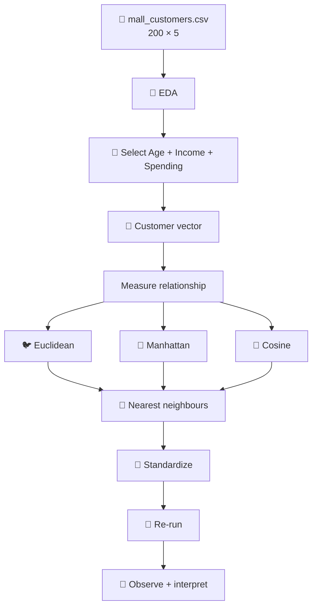
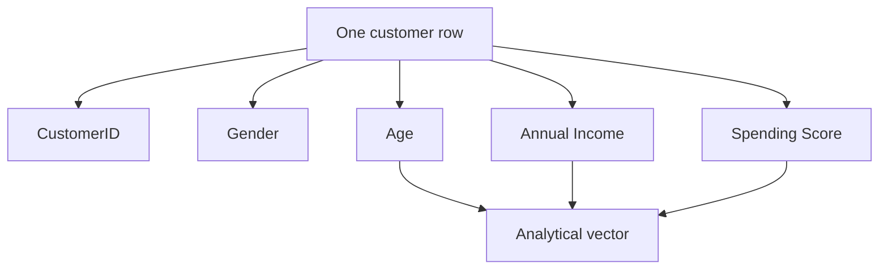
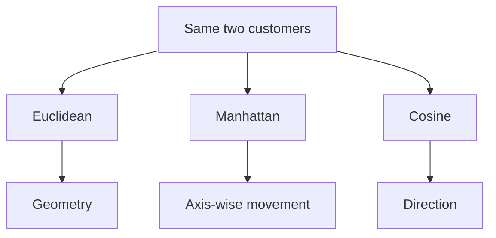
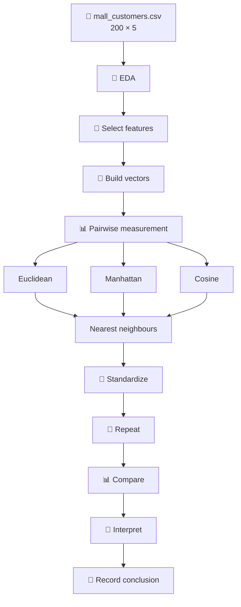

# INT396 Practical 1 — Customer Similarity

> **Customer Behavior Analysis with Euclidean, Manhattan and Cosine Similarity**

This practical uses the real `mall_customers.csv` dataset to answer one question:

> **How can a computer measure whether two customers are similar when no customer group is given?**

---

## 1. Practical objective

You will:

- inspect the real customer data;
- select the correct analytical features;
- represent a customer as a vector;
- calculate Euclidean distance;
- calculate Manhattan distance;
- calculate Cosine similarity and cosine distance correctly;
- compare one customer with the other 199 customers;
- find nearest neighbours;
- standardize the features;
- repeat the experiment;
- explain what changed and why.

### Complete workflow




---

## 2. Dataset

Input file:

```text
mall_customers.csv
```

Actual dataset:

| Property | Value |
|---|---:|
| Rows | 200 |
| Columns | 5 |
| Missing values | 0 |

### Columns

| Column | Meaning | Analytical feature? |
|---|---|:---:|
| `CustomerID` | identifier | No |
| `Gender` | descriptive category | No |
| `Age` | age | Yes |
| `Annual Income (k$)` | income in thousands | Yes |
| `Spending Score (1-100)` | spending score | Yes |

Use:

$$
X=[Age,Income,Spending]
$$

Do not use `CustomerID` as a mathematical feature. It identifies the observation but does not describe its behaviour.

---

## 3. GitHub repository

```text
INT396-Practical-01/
├── README.md
├── mall_customers.csv
├── similarity_lab.py
├── requirements.txt
├── images/
│   ├── 01_workflow.svg
│   ├── 02_customer_vector.svg
│   ├── 03_euclidean_steps.svg
│   ├── 04_manhattan.svg
│   ├── 05_cosine.svg
│   └── 06_scaling.svg
└── outputs/
    ├── customer_space.png
    ├── scaling_comparison.png
    └── nearest_comparison.png
```

---

## 4. Setup

### Local Python

```bash
python -m pip install -r requirements.txt
python similarity_lab.py
```

Optional explicit paths:

```bash
python similarity_lab.py --data mall_customers.csv --output outputs
```

### Google Colab

#### Cell 1 — Install

```python
!pip install -q numpy pandas matplotlib scikit-learn
```

#### Cell 2 — Imports

```python
import numpy as np
import pandas as pd
import matplotlib.pyplot as plt

from sklearn.metrics import pairwise_distances
from sklearn.metrics.pairwise import cosine_similarity, cosine_distances
from sklearn.preprocessing import StandardScaler
```

| Library | Why |
|---|---|
| pandas | CSV and tabular data |
| NumPy | vector arithmetic |
| Matplotlib | visualization |
| scikit-learn distances | pairwise distances |
| cosine functions | cosine distance/similarity |
| StandardScaler | standardization |

---

# 5. Step 1 — Load and inspect

### Cell 3

```python
df = pd.read_csv("mall_customers.csv")
print(df.shape)
```

Output:

```text
(200, 5)
```

### Cell 4

```python
print(df.head())
print(df.info())
```

The real dataset begins with:

| CustomerID | Gender | Age | Income | Spending |
|---:|---|---:|---:|---:|
| 1 | Male | 19 | 15 | 39 |
| 2 | Male | 21 | 15 | 81 |
| 3 | Female | 20 | 16 | 6 |
| 4 | Female | 23 | 16 | 77 |
| 5 | Female | 31 | 17 | 40 |

### Cell 5 — Missing values

```python
print(df.isna().sum())
```

Output:

```text
CustomerID                 0
Gender                     0
Age                        0
Annual Income (k$)         0
Spending Score (1-100)     0
```

**Observation:** the uploaded dataset has no missing values.

---

# 6. Step 2 — Select features

### Cell 6

```python
FEATURES = [
    "Age",
    "Annual Income (k$)",
    "Spending Score (1-100)"
]

X = df[FEATURES]
```




---

# 7. Step 3 — EDA

### Cell 7

```python
print(X.describe().round(2))
```

Real summary:

| Statistic | Age | Income (k$) | Spending |
|---|---:|---:|---:|
| Count | 200 | 200 | 200 |
| Mean | 38.85 | 60.56 | 50.20 |
| Std | 13.97 | 26.26 | 25.82 |
| Min | 18.00 | 15.00 | 1.00 |
| Median | 36.00 | 61.50 | 50.00 |
| Max | 70.00 | 137.00 | 99.00 |

### Important observation

The features have different numeric ranges.

```text
Age       → 18–70
Income    → 15–137
Spending  → 1–99
```

This does not make distance calculation impossible.

It creates a preprocessing question:

> **Should the features be placed on a comparable scale before measuring distance?**

That question is tested later.

### Cell 8 — Visualize the real data

```python
plt.figure(figsize=(9, 5))
plt.scatter(
    df["Annual Income (k$)"],
    df["Spending Score (1-100)"],
    s=30,
    alpha=0.72
)

plt.xlabel("Annual Income (k$)")
plt.ylabel("Spending Score (1-100)")
plt.title("Mall Customers: Income vs Spending")
plt.tight_layout()
plt.show()
```


At this point, the task is **exploration**, not clustering.

---

# 8. Step 4 — Build the customer vectors

Use two actual rows from the dataset.

### Cell 9

```python
A = df.iloc[0][FEATURES].to_numpy(dtype=float)
B = df.iloc[1][FEATURES].to_numpy(dtype=float)

print("A =", A)
print("B =", B)
```

Output:

```text
A = [19. 15. 39.]
B = [21. 15. 81.]
```

Therefore:

$$
A=[19,15,39]
$$

$$
B=[21,15,81]
$$

Vector order:

```text
[Age, Income, Spending]
```

---

# 9. Step 5 — Euclidean distance


### Question

> **How far apart are A and B in this feature space?**

### Formula

$$
d_E(A,B)=
\sqrt{\sum_{i=1}^{n}(A_i-B_i)^2}
$$

For three features:

$$
d_E=
\sqrt{
(A_1-B_1)^2+
(A_2-B_2)^2+
(A_3-B_3)^2
}
$$

### Step-by-step calculation

#### 1. Subtract

$$
A-B=[-2,0,-42]
$$

#### 2. Square

$$
[-2,0,-42]^2=[4,0,1764]
$$

#### 3. Add

$$
4+0+1764=1768
$$

#### 4. Square root

$$
\sqrt{1768}=42.0476
$$

### Code

```python
euclidean = np.linalg.norm(A - B)
print(f"Euclidean distance: {euclidean:.4f}")
```

Output:

```text
Euclidean distance: 42.0476
```

| Metric | Result |
|---|---:|
| Euclidean | **42.0476** |

### Interpretation

Lower value means closer under this Euclidean feature space.

---

# 10. Step 6 — Manhattan distance


### Formula

$$
d_M(A,B)=\sum_{i=1}^{n}|A_i-B_i|
$$

For the real example:

$$
|19-21|+|15-15|+|39-81|
$$

$$
=2+0+42=44
$$

### Code

```python
manhattan = np.abs(A - B).sum()
print(f"Manhattan distance: {manhattan:.4f}")
```

Output:

```text
Manhattan distance: 44.0000
```

| Metric | Result |
|---|---:|
| Manhattan | **44.0000** |

### Interpretation

Manhattan adds the absolute difference separately across the dimensions.

```text
Euclidean → direct geometric separation
Manhattan → total axis-wise separation
```

---

# 11. Step 7 — Cosine similarity


### Question

> **How aligned are the two vectors?**

### Formula

$$
s_{cos}(A,B)=
rac{A\cdot B}{\|A\|\|B\|}
$$

where:

$$
A\cdot B=\sum_i A_iB_i
$$

and:

$$
\|A\|=\sqrt{\sum_i A_i^2}
$$

### Similarity vs distance

Cosine distance:

$$
d_{cos}=1-s_{cos}
$$

Therefore:

$$
s_{cos}=1-d_{cos}
$$

### Code

```python
cosine_dist = cosine_distances(
    A.reshape(1, -1),
    B.reshape(1, -1)
)[0, 0]

cosine_sim = cosine_similarity(
    A.reshape(1, -1),
    B.reshape(1, -1)
)[0, 0]

print(f"Cosine distance   : {cosine_dist:.4f}")
print(f"Cosine similarity : {cosine_sim:.4f}")
```

Real output:

| Measure | Value |
|---|---:|
| Cosine distance | **0.0306** |
| Cosine similarity | **0.9694** |

### Interpretation

A value close to `1` means strong directional alignment.

---

# 12. Step 8 — Compare the metrics

| Metric | Value | Better direction | Question |
|---|---:|---|---|
| Euclidean | 42.0476 | lower | How far? |
| Manhattan | 44.0000 | lower | How much axis-wise movement? |
| Cosine similarity | 0.9694 | higher | How aligned? |



**Do not compare the raw magnitudes as if they were the same scale.** Each measure has a different definition.

---

# 13. Step 9 — Find the nearest customers in all 200 rows

The real experiment is now:

```text
Customer 1
    ↓
compare with remaining 199 customers
    ↓
calculate score
    ↓
sort
    ↓
top 5
```

## Euclidean

```python
query = X[0:1]

d = pairwise_distances(
    X,
    query,
    metric="euclidean"
).ravel()

order = np.argsort(d)
order = order[order != 0][:5]

for idx in order:
    print(int(df.iloc[idx]["CustomerID"]), d[idx])
```

Real top 5:

| Rank | Customer | Distance |
|---:|---:|---:|
| 1 | 5 | 12.2066 |
| 2 | 17 | 17.5499 |
| 3 | 21 | 18.7883 |
| 4 | 29 | 26.4764 |
| 5 | 49 | 27.0924 |

## Manhattan

```python
d = pairwise_distances(
    X,
    query,
    metric="manhattan"
).ravel()

order = np.argsort(d)
order = order[order != 0][:5]
```

Real top 5:

| Rank | Customer | Distance |
|---:|---:|---:|
| 1 | 5 | 15.0000 |
| 2 | 17 | 26.0000 |
| 3 | 21 | 29.0000 |
| 4 | 18 | 34.0000 |
| 5 | 3 | 35.0000 |

## Cosine

```python
d = cosine_distances(X, query).ravel()

order = np.argsort(d)
order = order[order != 0][:5]

for idx in order:
    similarity = 1 - d[idx]
    print(int(df.iloc[idx]["CustomerID"]), similarity)
```

Real top 5:

| Rank | Customer | Similarity |
|---:|---:|---:|
| 1 | 24 | 0.9984 |
| 2 | 28 | 0.9969 |
| 3 | 38 | 0.9955 |
| 4 | 10 | 0.9940 |
| 5 | 26 | 0.9940 |


### What should you notice?

Euclidean and Manhattan agree on the first three customers here, but their later ranks differ.

Cosine produces a different list.

That is the practical evidence that **metric choice changes the meaning of “nearest.”**

---

# 14. Step 10 — Scaling experiment


### Standardization

$$
z=rac{x-\mu}{\sigma}
$$

### Code

```python
scaler = StandardScaler()
X_scaled = scaler.fit_transform(X)

A_scaled = X_scaled[0]
B_scaled = X_scaled[1]
```

Repeat the metrics:

```python
euclidean_scaled = np.linalg.norm(A_scaled - B_scaled)
manhattan_scaled = np.abs(A_scaled - B_scaled).sum()

cosine_scaled = cosine_similarity(
    A_scaled.reshape(1, -1),
    B_scaled.reshape(1, -1)
)[0, 0]
```

### Real result

| Metric | Raw | Standardized |
|---|---:|---:|
| Euclidean | 42.0476 | **1.6368** |
| Manhattan | 44.0000 | **1.7740** |
| Cosine | 0.9694 | **0.7659** |


### Interpretation

The rows did not change.

The **feature coordinate system changed**.

Therefore the measured relationship changed.

---

# 15. Controlled experiments

These are the experiments to perform after the main run.

## Experiment A — Change the query

```python
query = X[20:21]
```

Re-run the nearest-neighbour calculation.

Record:

| Question | Observation |
|---|---|
| Did the nearest customer change? | |
| Did the top five change? | |
| Why? | |

## Experiment B — Compare raw and scaled space

```python
print("Raw:", np.linalg.norm(A - B))
print("Scaled:", np.linalg.norm(A_scaled - B_scaled))
```

Expected:

| Space | Euclidean |
|---|---:|
| Raw | 42.0476 |
| Standardized | 1.6368 |

## Experiment C — Compare metric rankings

Write the top five customer IDs:

```text
Euclidean:
____________________

Manhattan:
____________________

Cosine:
____________________
```

Then answer:

> Why are the rankings not identical?

---

# 16. Common mistakes

| Mistake | Correct rule |
|---|---|
| Include `CustomerID` | use it only as an identifier |
| Read cosine distance as similarity | convert using `1 - distance` |
| Compare `42` and `0.97` directly | interpret each metric on its own scale |
| Skip EDA | inspect ranges before choosing preprocessing |
| Assume scaling always improves everything | scaling changes the representation; evaluate the effect |
| Use chart position as the score | the formula/code determines the score |

---

# 17. Practical record

| Item | Result |
|---|---|
| Dataset | `mall_customers.csv` |
| Rows | 200 |
| Analytical features | 3 |
| Missing values | 0 |
| Euclidean, Customer 1 vs 2 | **42.0476** |
| Manhattan, Customer 1 vs 2 | **44.0000** |
| Cosine similarity | **0.9694** |
| Scaled Euclidean | **1.6368** |
| Scaled Manhattan | **1.7740** |
| Scaled Cosine similarity | **0.7659** |

### Final conclusion

> Distance and similarity measures convert unlabeled observations into numerical relationships. Euclidean and Manhattan measure distance using different geometric assumptions, while Cosine measures directional alignment. Feature scaling changes the coordinate system and can therefore change distance-based relationships. Metric choice should match the meaning of “similar” in the problem.

---

# 18. Final concept map



---

## 19. Complete executable script

The repository contains `similarity_lab.py`.

Run:

```bash
python similarity_lab.py
```

The script performs:

```text
load
→ validate
→ EDA
→ raw metrics
→ standardization
→ scaled metrics
→ nearest neighbours
→ save charts
```

Use the same script locally or from the repository.
