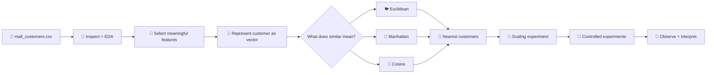
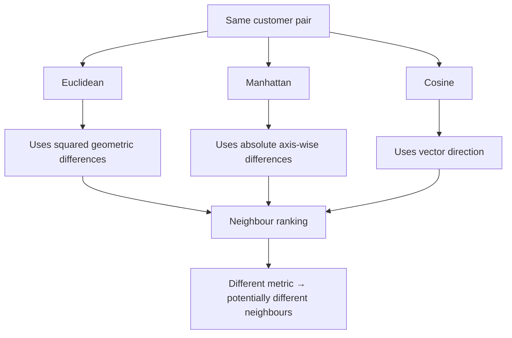

# INT396 — Practical 1
## Customer Behavior Analysis with Euclidean, Manhattan & Cosine Similarity

> **A complete, practical-first guide using the real `mall_customers.csv` dataset.**

This practical answers one question:

> **How can a computer measure whether two customers are similar when the dataset does not provide customer groups?**

The practical moves from **real data → simple example → mathematics → Python → real 200-customer experiment → scaling → nearest neighbours → interpretation**.

---

## 🧭 1. Practical map




### The four questions used throughout the practical

| Question | What we do |
|---|---|
| **What do we have?** | inspect the customer data |
| **How do we represent it?** | convert selected columns into vectors |
| **How do we measure closeness?** | choose a distance/similarity metric |
| **What does the result mean?** | compare neighbours and interpret |

---

# 2. 🎯 What you should be able to do

After completing the practical, you should be able to:

- load and inspect an unlabeled customer dataset;
- explain the role of every column;
- choose the numerical features used for similarity;
- represent a customer as a vector;
- derive Euclidean distance step by step;
- derive Manhattan distance step by step;
- explain Cosine similarity as a directional measure;
- distinguish cosine **distance** from cosine **similarity**;
- find nearest customers in a real dataset;
- explain why different metrics can produce different neighbours;
- explain why feature scaling affects distance-based analysis;
- run the same experiment locally or in Google Colab;
- interpret the output instead of only printing numbers.

---

# 3. 🧰 Files and setup

## Repository structure

```text
INT396-Practical-01/
│
├── README.md
├── mall_customers.csv
├── similarity_lab.py
├── requirements.txt
│
└── images/
    ├── 01_workflow.svg
    ├── 02_dataset.svg
    ├── 03_euclidean_steps.svg
    ├── 04_manhattan.svg
    ├── 05_cosine.svg
    ├── 06_scaling.svg
    └── 07_metric_choice.svg
```

The repository version uses the uploaded **200-row `mall_customers.csv`**.

---

## Install dependencies

### Local Python

```bash
python -m pip install -r requirements.txt
```

### Google Colab

```python
!pip install pandas numpy matplotlib seaborn scikit-learn
```

Then upload the dataset:

```python
from google.colab import files

files.upload()
```

Select:

```text
mall_customers.csv
```

---

# 4. 📄 Understand the actual dataset


The uploaded file contains:

```text
Rows    = 200
Columns = 5
```

The columns are:

| Column | Meaning | Used in similarity? |
|---|---|---|
| `CustomerID` | customer/row identifier | ❌ |
| `Gender` | descriptive category | ❌ |
| `Age` | age in years | ✅ |
| `Annual Income (k$)` | annual income in thousands | ✅ |
| `Spending Score (1-100)` | spending score | ✅ |

## Why not use `CustomerID`?

Suppose:

```text
CustomerID = 10
CustomerID = 20
```

Does customer 20 have twice the similarity of customer 10?

No.

An ID identifies an observation. It is not a behavioural measurement.

So:

```python
FEATURES = [
    "Age",
    "Annual Income (k$)",
    "Spending Score (1-100)"
]

X = df[FEATURES]
```

## Why not use `Gender` in the distance formula?

Gender is categorical. The practical's distance calculations operate directly on the three numerical customer-behaviour features.

It may be used for descriptive analysis or visualization, but it should not be inserted into the Euclidean/Manhattan numerical vector as if it were a continuous numeric measurement.

---

# 5. 🔎 Step 1 — Load and inspect

## Cell 1 — Import libraries

```python
import numpy as np
import pandas as pd
import matplotlib.pyplot as plt

from sklearn.metrics import pairwise_distances
from sklearn.metrics.pairwise import cosine_distances
from sklearn.preprocessing import StandardScaler
```

### What each library is doing

| Library | Practical job |
|---|---|
| `numpy` | numerical arrays and arithmetic |
| `pandas` | read and inspect CSV data |
| `matplotlib` | plot the dataset |
| `pairwise_distances` | Euclidean / Manhattan distances |
| `cosine_distances` | cosine distance |
| `StandardScaler` | standardization |

---

## Cell 2 — Read the dataset

### Colab / local

```python
df = pd.read_csv("mall_customers.csv")
```

Check that it loaded:

```python
print(df.shape)
```

Expected:

```text
(200, 5)
```

---

## Cell 3 — Look at the first rows

```python
df.head()
```

The beginning of the real dataset is:

```text
CustomerID  Gender   Age  Annual Income (k$)  Spending Score (1-100)
1           Male     19   15                   39
2           Male     21   15                   81
3           Female   20   16                    6
4           Female   23   16                   77
5           Female   31   17                   40
```

---

## Cell 4 — Check structure

```python
df.info()
```

This answers:

```text
How many rows?
Which columns?
Which columns are numeric?
Which columns are text?
```

---

## Cell 5 — Check missing values

```python
df.isna().sum()
```

For the uploaded dataset, all columns contain:

```text
0 missing values
```

So there is no missing-value problem to solve before this practical's calculations.

---

## Cell 6 — Statistical summary

```python
df[FEATURES].describe().round(2)
```

Actual dataset summary:

| Feature | Mean | Std | Min | 25% | 50% | 75% | Max |
|---|---:|---:|---:|---:|---:|---:|---:|
| Age | 38.85 | 13.97 | 18 | 28.75 | 36 | 49 | 70 |
| Annual Income | 60.56 | 26.26 | 15 | 41.50 | 61.50 | 78 | 137 |
| Spending Score | 50.20 | 25.82 | 1 | 34.75 | 50 | 73 | 99 |

### First important observation

The feature scales are not identical.

```text
Age              → tens
Income           → tens / above 100
Spending Score   → 1–100
```

This becomes important later.

---

# 6. 📊 Step 2 — See the customers

A visualization helps us form intuition before calculating anything.

```python
plt.figure(figsize=(9, 6))

scatter = plt.scatter(
    df["Annual Income (k$)"],
    df["Spending Score (1-100)"],
    c=df["Age"],
    cmap="viridis",
    s=55,
    alpha=0.85,
)

plt.xlabel("Annual Income (k$)")
plt.ylabel("Spending Score (1-100)")
plt.title("Mall Customers — Income vs Spending")
plt.colorbar(scatter, label="Age")
plt.show()
```

### What are we asking?

Not:

> “Where are the clusters?”

That would be a later clustering task.

Here we ask:

> **Which customers appear close enough that we may want to compare them mathematically?**

That gives us the need for a distance/similarity definition.

---

# 7. 🧩 Step 3 — Represent customers as vectors

Take the first two real customers.

```python
A = df.iloc[0][FEATURES].to_numpy(dtype=float)
B = df.iloc[1][FEATURES].to_numpy(dtype=float)

print("A =", A)
print("B =", B)
```

Actual values:

```text
A = [19, 15, 39]
B = [21, 15, 81]
```

Conceptually:

```text
A = [ Age, Income, Spending ]
    [ 19 ,   15  ,    39    ]

B = [ Age, Income, Spending ]
    [ 21 ,   15  ,    81    ]
```

So a customer can be represented as a vector:

$$
A = [A_1,A_2,A_3]
$$

and another customer as:

$$
B = [B_1,B_2,B_3]
$$

The practical now has a mathematical object to work with.

---

# 8. 🐦 Step 4 — Euclidean distance


## 8.1 Meaning

Euclidean distance means the direct geometric distance between two points.

$$
d_E(A,B)
=
\sqrt{
\sum_{i=1}^{n}(A_i-B_i)^2
}
$$

For three features:

$$
d_E(A,B)
=
\sqrt{
(A_1-B_1)^2+
(A_2-B_2)^2+
(A_3-B_3)^2
}
$$

---

## 8.2 Work through the real data

We have:

$$
A=[19,15,39]
$$

$$
B=[21,15,81]
$$

### Operation 1 — subtract

$$
19-21=-2
$$

$$
15-15=0
$$

$$
39-81=-42
$$

So:

$$
A-B=[-2,0,-42]
$$

### Operation 2 — square

$$
(-2)^2=4
$$

$$
0^2=0
$$

$$
(-42)^2=1764
$$

### Operation 3 — add

$$
4+0+1764=1768
$$

### Operation 4 — square root

$$
\sqrt{1768}\approx42.0476
$$

Therefore:

$$
\boxed{d_E\approx42.05}
$$

---

## 8.3 Python implementation

```python
difference = A - B
squared = difference ** 2
squared_sum = squared.sum()
euclidean = np.sqrt(squared_sum)

print("Difference:", difference)
print("Squared:", squared)
print("Squared sum:", squared_sum)
print("Euclidean:", euclidean)
```

Expected:

```text
Difference: [-2.  0. -42.]
Squared: [   4.    0. 1764.]
Squared sum: 1768.0
Euclidean: 42.047592...
```

### Short library version

```python
euclidean = np.linalg.norm(A - B)

print(f"Euclidean distance: {euclidean:.4f}")
```

Output:

```text
Euclidean distance: 42.0476
```

### The important learning connection

```text
INPUT
A, B
 ↓
SUBTRACT
A − B
 ↓
SQUARE
(A − B)²
 ↓
ADD
Σ(...)
 ↓
SQRT
√(...)
 ↓
OUTPUT
42.0476
```

The final number is the end of a chain of operations.

---

# 9. 🚕 Step 5 — Manhattan distance


## 9.1 Meaning

Manhattan distance sums the absolute movement along each dimension.

$$
d_M(A,B)
=
\sum_{i=1}^{n}|A_i-B_i|
$$

For three features:

$$
d_M(A,B)
=
|A_1-B_1|
+
|A_2-B_2|
+
|A_3-B_3|
$$

---

## 9.2 Real data calculation

$$
|19-21|=2
$$

$$
|15-15|=0
$$

$$
|39-81|=42
$$

Then:

$$
2+0+42=44
$$

Therefore:

$$
\boxed{d_M=44}
$$

---

## 9.3 Python

Manual implementation:

```python
difference = np.abs(A - B)
manhattan = difference.sum()

print("Absolute differences:", difference)
print(f"Manhattan distance: {manhattan:.4f}")
```

Output:

```text
Absolute differences: [ 2.  0. 42.]
Manhattan distance: 44.0000
```

Library implementation:

```python
manhattan = pairwise_distances(
    [A],
    [B],
    metric="manhattan"
)[0, 0]

print(manhattan)
```

---

# 10. 🧭 Step 6 — Cosine similarity


Euclidean and Manhattan ask:

> “How far apart are these vectors?”

Cosine asks:

> **“How aligned are these vectors?”**

The formula is:

$$
\operatorname{cos}(A,B)
=
\frac{A\cdot B}
{\|A\|\|B\|}
$$

where:

$$
A\cdot B
=
\sum_{i=1}^{n}A_iB_i
$$

and:

$$
\|A\|
=
\sqrt{\sum_{i=1}^{n}A_i^2}
$$

### Interpretation

```text
+1  → same direction
 0  → little directional alignment
-1  → opposite direction
```

---

## 10.1 Important library detail

`cosine_distances()` gives cosine **distance**.

If:

$$
d_C(A,B)=\text{cosine distance}
$$

then:

$$
\text{cosine similarity}=1-d_C(A,B)
$$

So in Python:

```python
cosine_distance = cosine_distances([A], [B])[0, 0]
cosine_similarity = 1 - cosine_distance

print(f"Cosine distance: {cosine_distance:.4f}")
print(f"Cosine similarity: {cosine_similarity:.4f}")
```

For the uploaded dataset:

```text
Cosine similarity: 0.9694
```

---

# 11. ⚖️ Compare the three measures

For the first two real customers:

| Measure | Actual result | Better value means |
|---|---:|---|
| Euclidean distance | `42.0476` | smaller |
| Manhattan distance | `44.0000` | smaller |
| Cosine similarity | `0.9694` | larger |


### Do not compare the numbers directly

It is incorrect to say:

```text
0.9694 < 42.0476
```

therefore cosine is “better”.

They are different quantities.

Instead:

```text
Euclidean
→ geometric separation

Manhattan
→ axis-wise separation

Cosine
→ directional similarity
```

---

# 12. 📏 Step 7 — Scaling experiment


The uploaded dataset has different feature magnitudes.

A distance formula simply operates on numbers.

It does not understand:

```text
19 years
15 k$
39 spending points
```

as different semantic units.

---

## 12.1 Standardization formula

For one feature:

$$
z=
\frac{x-\mu}{\sigma}
$$

where:

- $x$ = original value
- $\mu$ = feature mean
- $\sigma$ = feature standard deviation

---

## 12.2 Apply `StandardScaler`

```python
scaler = StandardScaler()

X = df[FEATURES]

X_scaled = scaler.fit_transform(X)
```

Now compare the same pair again:

```python
A_scaled = X_scaled[0]
B_scaled = X_scaled[1]

scaled_euclidean = np.linalg.norm(
    A_scaled - B_scaled
)

scaled_manhattan = np.abs(
    A_scaled - B_scaled
).sum()

scaled_cosine = 1 - cosine_distances(
    [A_scaled],
    [B_scaled]
)[0, 0]

print(f"Scaled Euclidean: {scaled_euclidean:.4f}")
print(f"Scaled Manhattan: {scaled_manhattan:.4f}")
print(f"Scaled Cosine: {scaled_cosine:.4f}")
```

Actual results for the uploaded dataset:

```text
Scaled Euclidean: 1.6368
Scaled Manhattan: 1.7740
Scaled Cosine: 0.7659
```

### What changed?

The formula stayed the same.

The input representation changed.

That is the core lesson:

```text
raw feature space
       ↓
metric
       ↓
relationship

scaled feature space
       ↓
same metric
       ↓
different relationship
```

---

# 13. 👥 Step 8 — Real nearest-neighbour experiment

Now use **all 200 customers**.

We choose Customer `1` as the target.

## 13.1 Euclidean nearest customers

```python
X = df[FEATURES].to_numpy(dtype=float)

target_id = 1
target_index = df.index[
    df["CustomerID"] == target_id
][0]

distances = pairwise_distances(
    X[target_index:target_index + 1],
    X,
    metric="euclidean"
)[0]

order = np.argsort(distances)

nearest = [
    index for index in order
    if index != target_index
][:5]

result = df.iloc[nearest][
    ["CustomerID", *FEATURES]
]

display(result)
```

Actual nearest Customer IDs:

```text
5
17
21
29
49
```

---

## 13.2 Manhattan nearest customers

Change only the metric:

```python
distances = pairwise_distances(
    X[target_index:target_index + 1],
    X,
    metric="manhattan"
)[0]
```

Actual nearest Customer IDs:

```text
5
17
21
18
3
```

Notice:

```text
Euclidean:
5, 17, 21, 29, 49

Manhattan:
5, 17, 21, 18, 3
```

The first three overlap, but the remaining neighbours change.

### What did we learn?

Changing the metric changes the definition of neighbourhood.

---

# 14. 🧭 Step 9 — Cosine nearest customers

For cosine we sort by **largest similarity**, not smallest distance.

```python
cosine_distance = cosine_distances(
    X[target_index:target_index + 1],
    X
)[0]

cosine_similarity = 1 - cosine_distance

order = np.argsort(-cosine_similarity)

nearest = [
    index for index in order
    if index != target_index
][:5]

result = df.iloc[nearest][
    ["CustomerID", *FEATURES]
]

display(result)
```

Actual top Customer IDs:

```text
24
28
38
10
26
```

This is very different from Euclidean.

That is not a bug.

It is the expected consequence of asking a different mathematical question.

---

# 15. 🧪 Step 10 — Controlled experiments

A practical experiment should change one thing at a time.

## Experiment A — raw vs standardized

```python
raw_distance = np.linalg.norm(X[0] - X[1])
scaled_distance = np.linalg.norm(
    X_scaled[0] - X_scaled[1]
)

print("Raw:", raw_distance)
print("Scaled:", scaled_distance)
```

Expected:

```text
Raw:    42.0476
Scaled: 1.6368
```

### Record

```text
What changed?
The feature representation.

Did the formula change?
No.

Did the result change?
Yes.
```

---

## Experiment B — change one feature only

```python
A_modified = A.copy()

A_modified[2] += 20

old_distance = np.linalg.norm(A - B)
new_distance = np.linalg.norm(A_modified - B)

print("Old:", old_distance)
print("New:", new_distance)
```

Only spending score changed.

Trace the effect:

```text
Spending changes
      ↓
Δspending changes
      ↓
(Δspending)² changes
      ↓
squared sum changes
      ↓
Euclidean distance changes
```

This is a much better learning experiment than only printing the final value.

---

## Experiment C — change the target customer

```python
for target_id in [1, 25, 50, 100, 150, 200]:
    target_index = df.index[
        df["CustomerID"] == target_id
    ][0]

    distances = pairwise_distances(
        X[target_index:target_index + 1],
        X,
        metric="euclidean"
    )[0]

    nearest = np.argsort(distances)

    nearest = [
        index for index in nearest
        if index != target_index
    ][:3]

    print(
        f"Target {target_id}:",
        df.iloc[nearest]["CustomerID"].tolist()
    )
```

### Observation

A different target produces a different neighbourhood.

This is the foundation of nearest-neighbour customer analysis.

---

# 16. 🧠 Why the metrics can disagree



There is no contradiction.

Each metric asks a different question.

---

# 17. ⚠️ Important mistakes to avoid

## Mistake 1 — including `CustomerID`

Wrong:

```python
X = df[
    [
        "CustomerID",
        "Age",
        "Annual Income (k$)",
        "Spending Score (1-100)"
    ]
]
```

Correct:

```python
X = df[FEATURES]
```

---

## Mistake 2 — treating cosine distance as similarity

Wrong:

```python
similarity = cosine_distances([A], [B])[0, 0]
```

Correct:

```python
distance = cosine_distances([A], [B])[0, 0]
similarity = 1 - distance
```

---

## Mistake 3 — using the smallest number across all metrics

Wrong reasoning:

```text
Cosine = 0.9694
Euclidean = 42.05

0.9694 is smaller, so cosine is better.
```

Correct reasoning:

```text
Euclidean → smaller distance
Manhattan → smaller distance
Cosine     → larger similarity
```

---

## Mistake 4 — blindly scaling every problem

Scaling is a modeling decision.

Ask:

```text
Are the feature units comparable?
Can one variable dominate because of magnitude?
Does the chosen algorithm depend on distance?
```

Then decide.

---

# 18. 🧪 Complete tested script

The repository contains:

```text
similarity_lab.py
```

Run:

```bash
python similarity_lab.py --data mall_customers.csv
```

The script:

```text
✔ validates the dataset
✔ prints shape and summary
✔ checks missing values
✔ calculates the real pair example
✔ shows intermediate Euclidean values
✔ calculates Manhattan
✔ calculates Cosine similarity
✔ standardizes the real dataset
✔ recalculates scaled relationships
✔ finds raw nearest neighbours
✔ finds standardized Euclidean neighbours
✔ generates a real plot
```

The script was tested against the **uploaded 200-row `mall_customers.csv`**.

Actual raw pair results from that run:

```text
Euclidean              42.0476
Manhattan              44.0000
Cosine similarity       0.9694
```

Actual standardized pair results:

```text
Euclidean               1.6368
Manhattan               1.7740
Cosine similarity        0.7659
```

The script also produced:

```text
outputs/income_vs_spending.png
```

---

# 19. ☁️ Google Colab — complete cell sequence

Use these cells in order.

### Cell 1 — upload

```python
from google.colab import files

files.upload()
```

### Cell 2 — imports

```python
import numpy as np
import pandas as pd
import matplotlib.pyplot as plt

from sklearn.metrics import pairwise_distances
from sklearn.metrics.pairwise import cosine_distances
from sklearn.preprocessing import StandardScaler
```

### Cell 3 — load

```python
df = pd.read_csv("mall_customers.csv")

print("Shape:", df.shape)
```

### Cell 4 — inspect

```python
display(df.head())
display(df.describe())
```

### Cell 5 — define features

```python
FEATURES = [
    "Age",
    "Annual Income (k$)",
    "Spending Score (1-100)"
]

X = df[FEATURES].to_numpy(dtype=float)
```

### Cell 6 — visualize

```python
plt.figure(figsize=(9, 6))

plt.scatter(
    df["Annual Income (k$)"],
    df["Spending Score (1-100)"],
    c=df["Age"],
    cmap="viridis",
    s=55
)

plt.xlabel("Annual Income (k$)")
plt.ylabel("Spending Score (1-100)")
plt.title("Mall Customers")
plt.colorbar(label="Age")
plt.show()
```

### Cell 7 — choose pair

```python
A = X[0]
B = X[1]

print("A:", A)
print("B:", B)
```

### Cell 8 — Euclidean

```python
difference = A - B
squared = difference ** 2
square_sum = squared.sum()

euclidean = np.sqrt(square_sum)

print("Difference:", difference)
print("Squared:", squared)
print("Squared sum:", square_sum)
print("Euclidean:", euclidean)
```

### Cell 9 — Manhattan

```python
absolute_difference = np.abs(A - B)

manhattan = absolute_difference.sum()

print("Absolute difference:", absolute_difference)
print("Manhattan:", manhattan)
```

### Cell 10 — Cosine

```python
cosine_distance = cosine_distances([A], [B])[0, 0]
cosine_similarity = 1 - cosine_distance

print("Cosine distance:", cosine_distance)
print("Cosine similarity:", cosine_similarity)
```

### Cell 11 — scaling

```python
scaler = StandardScaler()

X_scaled = scaler.fit_transform(X)

display(pd.DataFrame(
    X_scaled,
    columns=FEATURES
).head())
```

### Cell 12 — scaled comparison

```python
A_scaled = X_scaled[0]
B_scaled = X_scaled[1]

print(
    "Scaled Euclidean:",
    np.linalg.norm(A_scaled - B_scaled)
)

print(
    "Scaled Manhattan:",
    np.abs(A_scaled - B_scaled).sum()
)

print(
    "Scaled Cosine:",
    1 - cosine_distances(
        [A_scaled],
        [B_scaled]
    )[0, 0]
)
```

### Cell 13 — nearest neighbours

```python
target_index = 0

distances = pairwise_distances(
    X[target_index:target_index + 1],
    X,
    metric="euclidean"
)[0]

order = np.argsort(distances)

nearest = [
    index
    for index in order
    if index != target_index
][:5]

display(
    df.iloc[nearest][
        [
            "CustomerID",
            "Age",
            "Annual Income (k$)",
            "Spending Score (1-100)"
        ]
    ]
)
```

### Cell 14 — compare all three

```python
for metric_name in ["euclidean", "manhattan", "cosine"]:

    if metric_name == "cosine":
        distances = cosine_distances(
            X[target_index:target_index + 1],
            X
        )[0]

        scores = 1 - distances
        order = np.argsort(-scores)

    else:
        scores = pairwise_distances(
            X[target_index:target_index + 1],
            X,
            metric=metric_name
        )[0]

        order = np.argsort(scores)

    nearest = [
        index
        for index in order
        if index != target_index
    ][:5]

    print(
        metric_name,
        df.iloc[nearest]["CustomerID"].tolist()
    )
```

---

# 20. 📝 Practical observation sheet

Use this at the end of the lab.

| Experiment | What changed? | What happened? | Why? |
|---|---|---|---|
| Euclidean | Move B | Distance changed | Δx / Δy changed |
| Manhattan | Route interpretation | Total route = 90 | absolute axis differences were added |
| Cosine | Vector angle | Similarity changed | angle changed |
| Scaling | Feature representation | distances changed | feature magnitudes changed |
| Target | Query customer | neighbours changed | pairwise relationships changed |
| Metric | Distance definition | ranking changed | each metric defines closeness differently |

---

# 21. ✅ Final checklist

Before finishing Practical 1, make sure you can explain all of these without looking at the code:

- [ ] Why this is an unlabeled-data problem.
- [ ] Why `CustomerID` is not a distance feature.
- [ ] Why `Gender` is not directly inserted into these numerical distance formulas.
- [ ] How the real customer row becomes a vector.
- [ ] How Euclidean is built from subtraction → square → sum → square root.
- [ ] How Manhattan is built from absolute differences → sum.
- [ ] Why Cosine measures direction.
- [ ] Why cosine distance and cosine similarity are different.
- [ ] Why raw and standardized distances differ.
- [ ] Why different metrics can return different neighbours.
- [ ] How the same code scales from two customers to all 200 customers.
- [ ] What the final nearest-customer result means.

---

# 22. 🧾 Final conclusion

The practical demonstrates a complete unsupervised customer-similarity workflow:

$$
\boxed{
\text{Real Data}
\rightarrow
\text{EDA}
\rightarrow
\text{Feature Representation}
\rightarrow
\text{Distance / Similarity}
\rightarrow
\text{Nearest Customers}
\rightarrow
\text{Interpretation}
}
$$

The most important lesson is not a particular formula.

It is this:

> **A similarity result is meaningful only when the representation, preprocessing, metric and interpretation all match the problem.**

---

## 📦 Included repository files

```text
INT396-Practical1/
├── README.md
├── mall_customers.csv
├── similarity_lab.py
├── requirements.txt
└── images/
    ├── 01_workflow.svg
    ├── 02_dataset.svg
    ├── 03_euclidean_steps.svg
    ├── 04_manhattan.svg
    ├── 05_cosine.svg
    ├── 06_scaling.svg
    └── 07_metric_choice.svg
```

The uploaded `market_basket.csv` was kept separate because it is a **market-basket/association-rule dataset**, not the customer-distance dataset required for Practical 1.
