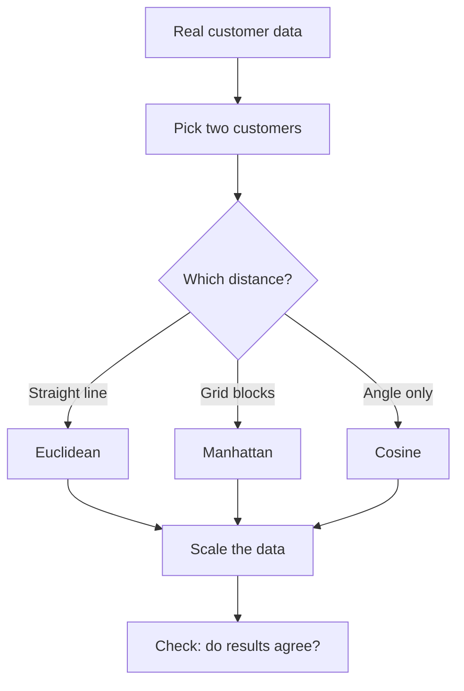
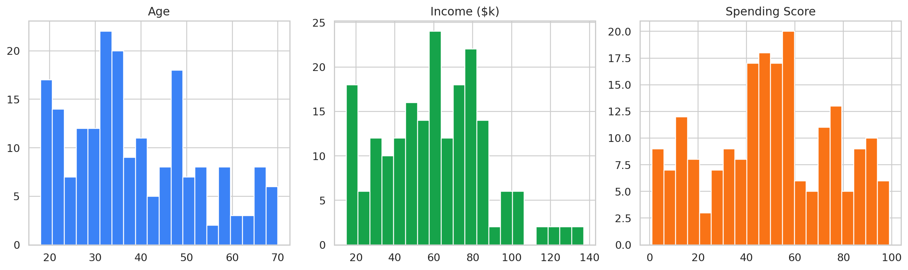
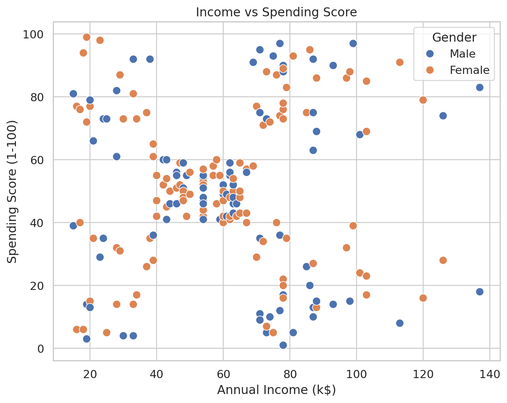

# 🧭 Practical 1 — Measuring "Closeness" Between Real Customers

   

---

## 📋 Quick Facts

| | |
|---|---|
| 📦 Dataset | `mall_customers.csv` — 200 real shoppers |
| 🎯 Course outcome | CO1, CO2 |
| 🛠️ Tools | `pandas`, `matplotlib`, `seaborn`, `scipy`, `scikit-learn` |
| ⏱️ Time | About 2 hours |
| ✅ Tested | Every number below is real output from running the code |

---

## 📑 Contents

1. [What You'll Learn](#1-what-youll-learn)
2. [Visual Overview](#2-visual-overview)
3. [Formulas](#3-formulas)
4. [Tools — Why, What, How](#4-tools-why-what-how)
5. [The Dataset](#5-the-dataset)
6. [Setup](#6-setup)
7. [Code Walkthrough](#7-code-walkthrough)
8. [Full Code](#8-full-code)
9. [Google Colab Version](#9-google-colab-version)
10. [Try It Yourself](#10-try-it-yourself)
11. [Common Mistakes](#11-common-mistakes)
12. [Quiz](#12-quiz)
13. [Summary](#13-summary)

---

<a id="1-what-youll-learn"></a>
## 1️⃣ What You'll Learn

We measure how "close" two real customers are, three different ways. This matters because every clustering method later in this course (k-Means, DBSCAN, etc.) is secretly built on distance.

**By the end you can:**
- Calculate Euclidean, Manhattan, and Cosine distance by hand and in code
- Prove why scaling data first is necessary
- Show that different distance methods can give different answers

---

<a id="2-visual-overview"></a>
## 2️⃣ Visual Overview



---

<a id="3-formulas"></a>
## 3️⃣ Formulas

> These are shown as plain text, not LaTeX, so they display correctly on every device and every markdown viewer.

**Euclidean distance** (straight-line distance):
```
distance = square root of:  (x1-y1)^2 + (x2-y2)^2 + ... + (xn-yn)^2
```
Subtract each pair of features, square it, add them all up, take the square root.

**Manhattan distance** (sum of differences):
```
distance = |x1-y1| + |x2-y2| + ... + |xn-yn|
```
Subtract each pair, take the positive value (drop the minus sign), add them up.

**Cosine similarity** (angle between two customers, ignoring size):
```
similarity = (x1*y1 + x2*y2 + ... + xn*yn) / (length of x * length of y)
```
Multiply matching features and add them up. Divide by each vector's own "length" (square every value, add, square-root). Result is between -1 and 1 — closer to 1 means a more similar pattern.

**StandardScaler** (used before every distance calculation):
```
scaled_value = (value - average) / standard_deviation
```
Every feature ends up with average 0 and a similar spread, so no single feature can dominate just because its raw numbers are bigger.

---

<a id="4-tools-why-what-how"></a>
## 4️⃣ Tools — Why, What, How

| Library | Why | What we use | How |
|---|---|---|---|
| `pandas` | Load and read the real data table | `read_csv()`, `.describe()` | `df = pd.read_csv(...)` |
| `scipy.spatial.distance` | Pre-tested distance formulas — no typos | `euclidean()`, `cityblock()`, `cosine()` | `euclidean(a, b)` |
| `sklearn.preprocessing` | Scale features fairly | `StandardScaler()` | `StandardScaler().fit_transform(X)` |
| `matplotlib` + `seaborn` | See the data before doing math | `.hist()`, `sns.scatterplot()` | shown in [Section 7](#7-code-walkthrough) |

💡 We don't import `numpy` — nothing in this script calls it directly, so it's left out.

---

<a id="5-the-dataset"></a>
## 5️⃣ The Dataset

📦 `../datasets/mall_customers.csv` — 200 real shoppers, 5 columns, no missing values, no labels.

| Column | Real range | Meaning |
|---|---|---|
| `CustomerID` | 1–200 | Row ID, not used in any math |
| `Gender` | Male/Female | Used only to color charts |
| `Age` | 18–70 | Age in years |
| `Annual Income (k$)` | 15–137 | Yearly income, thousands of $ |
| `Spending Score (1-100)` | 1–99 | Mall-assigned spending score |

We only use `Age`, `Annual Income (k$)`, and `Spending Score (1-100)` for distance math.

---

<a id="6-setup"></a>
## 6️⃣ Setup

```bash
pip install pandas matplotlib seaborn scipy scikit-learn
```

```python
import os
import pandas as pd
import matplotlib.pyplot as plt
import seaborn as sns
from scipy.spatial.distance import euclidean, cityblock, cosine
from sklearn.preprocessing import StandardScaler
```

---

<a id="7-code-walkthrough"></a>
## 7️⃣ Code Walkthrough

### Step 1 — Load the data

```python
df = pd.read_csv("../datasets/mall_customers.csv")
print("Loaded", len(df), "real customers")
print(df.describe().round(1))
```

**Real output:**
```
Loaded 200 real customers
       CustomerID    Age  Annual Income (k$)  Spending Score (1-100)
count       200.0  200.0               200.0                   200.0
mean        100.5   38.8                60.6                    50.2
std          57.9   14.0                26.3                    25.8
min           1.0   18.0                15.0                     1.0
max         200.0   70.0               137.0                    99.0
```

🚩 Income's range (15–137) is almost double Age's range (18–70). Keep this in mind for Step 4.

---

### Step 2 — Picture the data

```python
features = ["Age", "Annual Income (k$)", "Spending Score (1-100)"]

fig, axes = plt.subplots(1, 3, figsize=(14, 4))
for ax, col in zip(axes, features):
    ax.hist(df[col], bins=20)
    ax.set_title(col)
plt.tight_layout()
plt.savefig("images/01_eda_distributions.png")
plt.close()
```



```python
plt.figure(figsize=(7, 6))
sns.scatterplot(data=df, x="Annual Income (k$)", y="Spending Score (1-100)", hue="Gender")
plt.title("Income vs Spending Score")
plt.savefig("images/02_income_vs_spending.png")
plt.close()
```



---

### Step 3 — Three distances, two real customers

```python
X = df[features].values
a, b = X[0], X[1]
print("Customer A:", df.iloc[0][features].to_dict())
print("Customer B:", df.iloc[1][features].to_dict())

print("Euclidean distance:", round(euclidean(a, b), 2))
print("Manhattan distance:", round(cityblock(a, b), 2))
print("Cosine similarity: ", round(1 - cosine(a, b), 4))
```

**Real output:**
```
Customer A: {'Age': 19, 'Annual Income (k$)': 15, 'Spending Score (1-100)': 39}
Customer B: {'Age': 21, 'Annual Income (k$)': 15, 'Spending Score (1-100)': 81}

Euclidean distance: 42.05
Manhattan distance: 44
Cosine similarity:  0.9694
```

**Check Euclidean by hand:**
```
Age:      (19-21)^2 = 4
Income:   (15-15)^2 = 0
Spending: (39-81)^2 = 1764
Total = 1768,  square root = 42.05   -- matches the code
```

---

### Step 4 — Scaling changes the answer

```python
X_scaled = StandardScaler().fit_transform(X)
print("Euclidean BEFORE scaling:", round(euclidean(a, b), 2))
print("Euclidean AFTER scaling: ", round(euclidean(X_scaled[0], X_scaled[1]), 2))
```

**Real output:**
```
Euclidean BEFORE scaling: 42.05
Euclidean AFTER scaling:  1.64
```

Before scaling, the Spending Score gap (42, squared = 1764) drowns out the Age gap (2, squared = 4). After scaling, every feature counts fairly.

> 🚩 Always scale before measuring distance, unless you have a real reason not to.

---

### Step 5 — Do Euclidean and Cosine agree?

```python
query = X_scaled[0]
euclidean_dist = [euclidean(query, row) for row in X_scaled]
cosine_dist = [cosine(query, row) for row in X_scaled]
df["euclidean_dist"] = euclidean_dist
df["cosine_dist"] = cosine_dist

nearest_by_euclidean = df.sort_values("euclidean_dist")["CustomerID"].iloc[1:6].tolist()
nearest_by_cosine = df.sort_values("cosine_dist")["CustomerID"].iloc[1:6].tolist()
print("Nearest 5 by Euclidean:", nearest_by_euclidean)
print("Nearest 5 by Cosine:   ", nearest_by_cosine)
```

**What this does:** calculates the distance from Customer 0 to every other real customer, saves it as a new column, then sorts to find the 5 closest. `.iloc[1:6]` skips row 0 itself (distance to yourself is always 0).

**Real output:**
```
Nearest 5 by Euclidean: [5, 18, 48, 17, 49]
Nearest 5 by Cosine:    [70, 49, 50, 48, 5]
```

Only 3 of 5 customers match between the two lists. **Different distance measures really do give different answers**, on the same real data.

---

<a id="8-full-code"></a>
## 8️⃣ Full Code

```python
import os
import pandas as pd
import matplotlib.pyplot as plt
import seaborn as sns
from scipy.spatial.distance import euclidean, cityblock, cosine
from sklearn.preprocessing import StandardScaler

os.makedirs("images", exist_ok=True)
sns.set_theme(style="whitegrid")

# Step 1: load real data
df = pd.read_csv("../datasets/mall_customers.csv")
print("Loaded", len(df), "real customers")
print(df.describe().round(1))

features = ["Age", "Annual Income (k$)", "Spending Score (1-100)"]

# Step 2: picture the data
fig, axes = plt.subplots(1, 3, figsize=(14, 4))
for ax, col in zip(axes, features):
    ax.hist(df[col], bins=20)
    ax.set_title(col)
plt.tight_layout()
plt.savefig("images/01_eda_distributions.png")
plt.close()

plt.figure(figsize=(7, 6))
sns.scatterplot(data=df, x="Annual Income (k$)", y="Spending Score (1-100)", hue="Gender")
plt.title("Income vs Spending Score")
plt.savefig("images/02_income_vs_spending.png")
plt.close()

# Step 3: compare 2 real customers, 3 ways
X = df[features].values
a, b = X[0], X[1]
print("\nCustomer A:", df.iloc[0][features].to_dict())
print("Customer B:", df.iloc[1][features].to_dict())
print("\nEuclidean distance:", round(euclidean(a, b), 2))
print("Manhattan distance:", round(cityblock(a, b), 2))
print("Cosine similarity: ", round(1 - cosine(a, b), 4))

# Step 4: scaling changes the answer
X_scaled = StandardScaler().fit_transform(X)
print("\nEuclidean BEFORE scaling:", round(euclidean(a, b), 2))
print("Euclidean AFTER scaling: ", round(euclidean(X_scaled[0], X_scaled[1]), 2))

# Step 5: do Euclidean and Cosine agree on Customer 0's nearest neighbours?
query = X_scaled[0]
euclidean_dist = [euclidean(query, row) for row in X_scaled]
cosine_dist = [cosine(query, row) for row in X_scaled]
df["euclidean_dist"] = euclidean_dist
df["cosine_dist"] = cosine_dist

nearest_by_euclidean = df.sort_values("euclidean_dist")["CustomerID"].iloc[1:6].tolist()
nearest_by_cosine = df.sort_values("cosine_dist")["CustomerID"].iloc[1:6].tolist()
print("\nNearest 5 customers by Euclidean:", nearest_by_euclidean)
print("Nearest 5 customers by Cosine:   ", nearest_by_cosine)

print("\nDone. Charts saved in images/")
```

64 lines. Every import used. Nothing defined twice.

---

<a id="9-google-colab-version"></a>
## 9️⃣ Google Colab Version

**Setup cell:**
```python
!git clone https://github.com/<your-username>/INT396-Unsupervised-Learning-Practicals.git
%cd INT396-Unsupervised-Learning-Practicals/Practical-01-EDA-Similarity-Measures
```

**Cell 1:**
```python
import os
import pandas as pd
import matplotlib.pyplot as plt
import seaborn as sns
from scipy.spatial.distance import euclidean, cityblock, cosine
from sklearn.preprocessing import StandardScaler

os.makedirs("images", exist_ok=True)
sns.set_theme(style="whitegrid")
```

**Cell 2:**
```python
df = pd.read_csv("../datasets/mall_customers.csv")
print("Loaded", len(df), "real customers")
print(df.describe().round(1))

features = ["Age", "Annual Income (k$)", "Spending Score (1-100)"]
```

**Cell 3:**
```python
fig, axes = plt.subplots(1, 3, figsize=(14, 4))
for ax, col in zip(axes, features):
    ax.hist(df[col], bins=20)
    ax.set_title(col)
plt.tight_layout()
plt.show()

plt.figure(figsize=(7, 6))
sns.scatterplot(data=df, x="Annual Income (k$)", y="Spending Score (1-100)", hue="Gender")
plt.title("Income vs Spending Score")
plt.show()
```

**Cell 4:**
```python
X = df[features].values
a, b = X[0], X[1]
print("Customer A:", df.iloc[0][features].to_dict())
print("Customer B:", df.iloc[1][features].to_dict())
print("Euclidean distance:", round(euclidean(a, b), 2))
print("Manhattan distance:", round(cityblock(a, b), 2))
print("Cosine similarity: ", round(1 - cosine(a, b), 4))
```

**Cell 5:**
```python
X_scaled = StandardScaler().fit_transform(X)
print("Euclidean BEFORE scaling:", round(euclidean(a, b), 2))
print("Euclidean AFTER scaling: ", round(euclidean(X_scaled[0], X_scaled[1]), 2))
```

**Cell 6:**
```python
query = X_scaled[0]
euclidean_dist = [euclidean(query, row) for row in X_scaled]
cosine_dist = [cosine(query, row) for row in X_scaled]
df["euclidean_dist"] = euclidean_dist
df["cosine_dist"] = cosine_dist

nearest_by_euclidean = df.sort_values("euclidean_dist")["CustomerID"].iloc[1:6].tolist()
nearest_by_cosine = df.sort_values("cosine_dist")["CustomerID"].iloc[1:6].tolist()
print("Nearest 5 by Euclidean:", nearest_by_euclidean)
print("Nearest 5 by Cosine:   ", nearest_by_cosine)
```

---

<a id="10-try-it-yourself"></a>
## 🔟 Try It Yourself

1. Change `a, b = X[0], X[1]` to two other customers — do the distances make sense?
2. Add `chebyshev` from `scipy.spatial.distance` as a 4th measure.
3. Change `query = X_scaled[0]` to a different customer — does agreement go up or down?
4. Run Step 5 again using the unscaled `X` instead of `X_scaled` — how much does the answer change?

---

<a id="11-common-mistakes"></a>
## ⚠️ Common Mistakes

| Mistake | Fix |
|---|---|
| Running from the wrong folder | `cd` into this practical's folder first |
| Forgetting to scale before comparing distances | Always run `StandardScaler().fit_transform(X)` first |
| Expecting `cosine()` to return similarity | It returns distance — use `1 - cosine(a, b)` |
| Including `CustomerID` as a feature | Only use real measurements: Age, Income, Spending Score |

---

<a id="12-quiz"></a>
## ❓ Quiz

1. What's the difference between Euclidean and Manhattan distance?
2. Why does Cosine similarity ignore size?
3. Which feature dominates if we forget to scale — Age or Income?
4. True or false: the distance measure you pick never changes your results?

<details>
<summary>Answers</summary>

1. Euclidean is straight-line; Manhattan adds up each feature's difference separately.
2. It only measures angle/direction, not length.
3. Income — its range (15–137) is much bigger than Age's (18–70).
4. False — Euclidean and Cosine only matched 3 of 5 neighbours here.

</details>

---

<a id="13-summary"></a>
## 📝 Summary

| Step | Real result |
|---|---|
| Loaded data | 200 rows, 0 missing |
| 3 distances | Euclidean 42.05, Manhattan 44, Cosine 0.9694 |
| Scaling | Distance dropped from 42.05 to 1.64 |
| Do measures agree | Only 3 of 5 neighbours matched |

## 📂 Files

| File | What it is |
|---|---|
| `similarity_demo.py` | 64-line tested script |
| `images/01_eda_distributions.png` | Age, Income, Spending charts |
| `images/02_income_vs_spending.png` | Main scatter plot |

➡️ **Next:** [Practical 2 — k-Means vs k-Medoids](../Practical-02-KMeans-vs-KMedoids/README.md)
