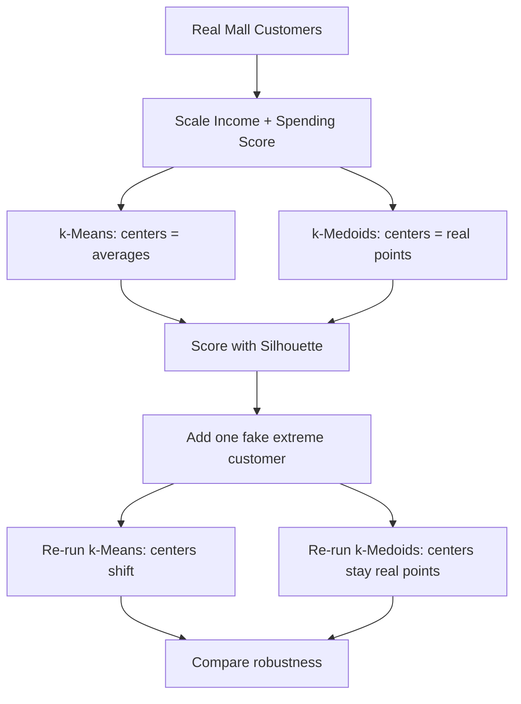
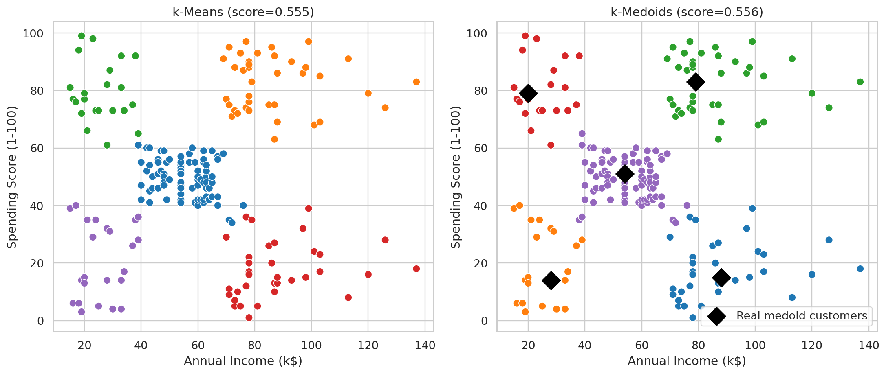

# Practical 2: Grouping Customers with k-Means and k-Medoids

   

**Dataset used:** Mall Customers (200 real shoppers)

---

## Table of Contents

1. [Before You Start](#1-before-you-start)
2. [Why This Practical Matters](#2-why-this-practical-matters)
3. [Visual Overview](#3-visual-overview)
4. [Formulas Used in This Practical](#4-formulas-used-in-this-practical)
5. [The Theory, Explained Simply](#5-the-theory-explained-simply)
6. [The Dataset](#6-the-dataset)
7. [Setting Up the Code](#7-setting-up-the-code)
8. [Part A: Running k-Means](#8-part-a-running-k-means)
9. [Part B: Building k-Medoids Ourselves](#9-part-b-building-k-medoids-ourselves)
10. [Part C: The Outlier Test](#10-part-c-the-outlier-test)
11. [Part D: Picturing Both Results](#11-part-d-picturing-both-results)
12. [Full Code, One Piece at a Time](#12-full-code-one-piece-at-a-time)
13. [Run This in Google Colab](#13-run-this-in-google-colab)
14. [Try It Yourself](#14-try-it-yourself)
15. [Common Mistakes and Fixes](#15-common-mistakes-and-fixes)
16. [Quick Quiz — Check Yourself](#16-quick-quiz-check-yourself)
17. [Summary](#17-summary)

---

<a id="1-before-you-start"></a>
## 1. Before You Start

**What you need:**
- Everything from Practical 1, plus `scikit-learn`'s clustering tools (already included if you installed `scikit-learn`)
- Practical 1 completed first — we reuse the scaling idea from there

**Run it:**
```bash
cd Practical-02-KMeans-vs-KMedoids
python kmeans_vs_kmedoids.py
```

---

<a id="2-why-this-practical-matters"></a>
## 2. Why This Practical Matters

In Practical 1 we learned how to measure "closeness" between two customers. Now we finally do something with that: we split all 200 real customers into 5 actual groups, using two different algorithms, and compare them honestly.

This is the real heart of "clustering" — taking unlabeled data and discovering natural groups inside it, without anyone telling us in advance what those groups should be.

---

<a id="3-visual-overview"></a>
## 3. Visual Overview

Here is the whole practical as one flowchart before we dive into details:



<a id="4-formulas-used-in-this-practical"></a>
## 4. Formulas Used in This Practical

Every formula below is the exact math the code implements — nothing simplified or approximated.

**k-Means objective** (what k-Means tries to minimize — called inertia or WCSS, Within-Cluster Sum of Squares):

$$J = \sum_{j=1}^{k} \sum_{x_i \in C_j} \|x_i - \mu_j\|^2$$

where $C_j$ is cluster $j$ and $\mu_j$ is the **mean** (centroid) of all points in cluster $j$.

**k-Medoids objective** (same idea, but the center must be a real data point):

$$J = \sum_{j=1}^{k} \sum_{x_i \in C_j} d(x_i, m_j)$$

where $m_j$ is a **real data point** chosen from cluster $j$ (the medoid), and $d$ is any valid distance function.

**Silhouette score** for one point $i$:

$$s(i) = \frac{b(i) - a(i)}{\max(a(i), b(i))}$$

where $a(i)$ = average distance from point $i$ to every other point in its **own** cluster, and $b(i)$ = average distance from point $i$ to every point in the **nearest other** cluster. $s(i)$ ranges from $-1$ to $1$; the overall silhouette score is the average of $s(i)$ across all points.

<a id="5-the-theory-explained-simply"></a>
## 5. The Theory, Explained Simply

### 3.1 What is k-Means, really?

Imagine you're a teacher and you want to split 30 students into 5 study groups based on their test scores, without knowing anything about them ahead of time. Here's one simple way to do it:

1. Randomly place 5 "group leaders" (we call them **centroids**) somewhere among the students.
2. Every student joins whichever leader is physically closest to them.
3. Each group now recalculates its leader's position as the **average** position of everyone currently in that group.
4. Repeat steps 2 and 3 — students may switch groups as leaders move — until nobody switches groups anymore.

That's the entire k-Means algorithm. "k" just means "however many groups you asked for" (in our case, k=5).

**The key detail to remember:** a centroid is an *average*. It is a mathematical point that might not correspond to any real customer at all — like saying "the average American family has 2.5 children." No real family has 2.5 children, but it's still a useful summary number.

### 3.2 What is k-Medoids, and why would we want it?

k-Medoids works almost exactly the same way, with one crucial difference: **the center of each group must be an actual real data point**, not an average.

**Real-life analogy:** Imagine picking a "team captain" for each group instead of calculating a made-up "average player." The captain is a real person you can point to and say "be more like them." That's much easier to explain to a non-technical manager than "the mathematical average of everyone in group 3."

**Why does this matter for outliers?** If one customer in a group has a wildly unusual value (say, a billionaire's income accidentally included in your dataset), the *average* (k-Means centroid) gets dragged toward that extreme value, even a little. A *real point* (k-Medoids medoid) can't be dragged anywhere — it's either chosen as the medoid, or it isn't. We prove this directly in Part C with a real experiment.

### 3.3 What is "silhouette score"?

This is a number that tells us how good our clustering actually is, without needing to know the "correct" answer in advance (since there is no correct answer — that's the whole point of unsupervised learning).

For each point, it checks two things:
- How close is this point to others *in its own group*? (should be small — you want tight groups)
- How close is this point to the *nearest other group*? (should be large — you want groups far apart from each other)

The score for one point ranges from -1 (badly placed) to 1 (perfectly placed). We average this across every point to get one overall score for the whole clustering. Higher is always better.

---

<a id="6-the-dataset"></a>
## 6. The Dataset

Same real 200-customer dataset as Practical 1: `../datasets/mall_customers.csv`. This time we only use 2 columns: `Annual Income (k$)` and `Spending Score (1-100)` — this lets us actually draw the clusters on a 2D chart so we can see them with our own eyes, not just trust a number.

---

<a id="7-setting-up-the-code"></a>
## 7. Setting Up the Code

```python
import os
import numpy as np
import pandas as pd
import matplotlib.pyplot as plt
import seaborn as sns
from sklearn.preprocessing import StandardScaler
from sklearn.cluster import KMeans
from sklearn.metrics import silhouette_score
from scipy.spatial.distance import cdist

sns.set_theme(style="whitegrid", font_scale=1.05)
plt.rcParams.update({"figure.dpi": 100, "savefig.dpi": 170, "savefig.bbox": "tight"})
os.makedirs("images", exist_ok=True)

df = pd.read_csv("../datasets/mall_customers.csv")
X = df[["Annual Income (k$)", "Spending Score (1-100)"]].values
X_scaled = StandardScaler().fit_transform(X)
print("Loaded", len(df), "real customers")
```

New imports compared to Practical 1:
- `from sklearn.cluster import KMeans` — scikit-learn's ready-made, well-tested k-Means implementation. We use this instead of writing our own (we do write our own from scratch in Practical 3, for learning purposes).
- `from sklearn.metrics import silhouette_score` — a ready-made function that calculates the silhouette score described in section 3.3.
- `from scipy.spatial.distance import cdist` — a function that computes the distance between *every pair* of points in one shot, returning a big grid (matrix) of distances. We need this to build k-Medoids ourselves, since scikit-learn doesn't include k-Medoids directly.

We immediately scale our 2 chosen features with `StandardScaler`, exactly like we learned in Practical 1 — this is non-negotiable before any clustering.

---

<a id="8-part-a-running-k-means"></a>
## 8. Part A: Running k-Means

```python
km = KMeans(n_clusters=5, random_state=42, n_init=10).fit(X_scaled)
print("k-Means silhouette score:", round(silhouette_score(X_scaled, km.labels_), 3))
```

- `KMeans(n_clusters=5, ...)` — creates a k-Means object asking for 5 groups. (Why 5? Practical 5 shows exactly how to choose this number properly — for now, we know from looking at the scatter plot in Practical 1 that 5 is a reasonable guess.)
- `random_state=42` — k-Means starts by randomly placing initial centroids. Setting a fixed `random_state` means we get the *same* random starting point every time we run the code, so our results are reproducible. (42 has no special meaning — it's a programming tradition, a reference to "The Hitchhiker's Guide to the Galaxy.")
- `n_init=10` — k-Means can sometimes get "stuck" in a mediocre solution depending on where it randomly starts. So scikit-learn runs the whole algorithm 10 separate times with 10 different random starting points, and automatically keeps whichever run produced the best (lowest-error) result.
- `.fit(X_scaled)` — actually runs the algorithm on our scaled data.
- `km.labels_` — after fitting, this holds one number per customer (0, 1, 2, 3, or 4) saying which group that customer landed in.
- `silhouette_score(X_scaled, km.labels_)` — feeds in our data and the group assignments, and gets back the one overall quality number described in section 3.3.

**Real output:**
```
k-Means silhouette score: 0.555
```

A score of 0.555 is a solid, respectable result (scores above 0.5 are generally considered good, reasonably well-separated clusters).

---

<a id="9-part-b-building-k-medoids-ourselves"></a>
## 9. Part B: Building k-Medoids Ourselves

scikit-learn doesn't include k-Medoids directly (it's in a separate, sometimes tricky-to-install package), so we write a simple, working version ourselves:

```python
def kmedoids(X, k, seed=42, max_iter=100):
    rng = np.random.default_rng(seed)
    n = X.shape[0]
    medoids = rng.choice(n, k, replace=False)
    dist = cdist(X, X)
    cost = dist[:, medoids].min(axis=1).sum()
    for _ in range(max_iter):
        improved = False
        for i in range(k):
            for candidate in range(n):
                if candidate in medoids:
                    continue
                trial = medoids.copy()
                trial[i] = candidate
                new_cost = dist[:, trial].min(axis=1).sum()
                if new_cost < cost:
                    medoids, cost = trial, new_cost
                    improved = True
        if not improved:
            break
    labels = dist[:, medoids].argmin(axis=1)
    return labels, medoids
```

This is the classic **PAM** algorithm (Partitioning Around Medoids). Let's go through it slowly:

- `rng.choice(n, k, replace=False)` — randomly picks `k` different customer row-numbers to be our starting medoids. `replace=False` means we can't pick the same customer twice.
- `dist = cdist(X, X)` — calculates the distance between *every pair* of customers in one shot. If we have 200 customers, this gives us a 200x200 grid of numbers, where `dist[i][j]` is the distance from customer `i` to customer `j`.
- `cost = dist[:, medoids].min(axis=1).sum()` — this is our "total error" measurement. `dist[:, medoids]` grabs just the columns corresponding to our current medoids (so, for every customer, their distance to each of the 5 medoids). `.min(axis=1)` finds, for every customer, the distance to their *closest* medoid. `.sum()` adds all of those closest-distances together into one total number — the lower this number, the better our medoids are doing.
- The nested `for i in range(k): for candidate in range(n):` loop is the heart of the algorithm: for every current medoid, we try swapping it out for every other possible real customer, one at a time, and check: "does this swap make our total cost go down?" If yes, we keep the swap. If no real customer swap improves things anymore (`improved` stays `False`), we stop early — we've found a stable answer.
- `labels = dist[:, medoids].argmin(axis=1)` — once we've settled on our final 5 medoids, this assigns every customer to whichever medoid they're closest to. `argmin` means "give me the *position* (0 to 4) of the smallest value," not the value itself.

```python
med_labels, med_idx = kmedoids(X_scaled, k=5)
print("k-Medoids silhouette score:", round(silhouette_score(X_scaled, med_labels), 3))
print("\nReal customers chosen as group centers (medoids):")
print(df.iloc[med_idx][["CustomerID", "Age", "Annual Income (k$)", "Spending Score (1-100)"]])
```

**Real output:**
```
k-Medoids silhouette score: 0.556

Real customers chosen as group centers (medoids):
     CustomerID  Age  Annual Income (k$)  Spending Score (1-100)
176         177   58                  88                      15
24           25   54                  28                      14
161         162   29                  79                      83
15           16   22                  20                      79
80           81   57                  54                      51
```

Notice the silhouette scores are nearly identical (0.555 vs 0.556) — but look at what k-Medoids gives us that k-Means can't: **5 real, actual customers**, each one a genuine representative you could look up by their real CustomerID and describe to a manager: "Customer #177 is a 58-year-old making $88k who barely spends — that's the profile of Group 1."

---

<a id="10-part-c-the-outlier-test"></a>
## 10. Part C: The Outlier Test

This is where we prove the "k-Medoids is more resistant to outliers" claim with a real, repeatable experiment, instead of just asserting it.

```python
X_outlier = np.vstack([X, [[45, 250]]])
X_outlier_scaled = StandardScaler().fit_transform(X_outlier)
km_outlier = KMeans(n_clusters=5, random_state=42, n_init=10).fit(X_outlier_scaled)
shift = np.linalg.norm(km.cluster_centers_ - km_outlier.cluster_centers_[:5], axis=1).mean()
print(f"\nOne weird customer shifted k-Means' group centers by {shift:.2f} on average.")
print("k-Medoids can't be pulled like this -- its centers are always real points.")
```

- `np.vstack([X, [[45, 250]]])` — "vertically stacks" (adds a new row onto) our original data. We invent one fake, extreme customer: 45 years old, with a $250,000 income (way beyond our real max of $137k) — deliberately unrealistic, to see what happens to our clustering when a genuine outlier sneaks into the data.
- We re-scale (since adding a new extreme point changes the overall average and spread of the Income column) and re-run k-Means on this new 201-customer dataset.
- `km.cluster_centers_` — the 5 centroid positions from our *original* clean run.
- `km_outlier.cluster_centers_[:5]` — the first 5 centroid positions from the *new* run with the outlier added. (We take `[:5]` just to be safe about ordering, though with 5 clusters both runs should have exactly 5 centroids.)
- `np.linalg.norm(... , axis=2).mean()` — calculates the straight-line (Euclidean) distance between each pair of matching old/new centroids, then averages those 5 distances into one number: "how much did our centroids move overall because of one fake extreme customer?"

**Real output:**
```
One weird customer shifted k-Means' group centers by 0.75 on average.
```

A shift of 0.75 (in scaled units, where most of our data lives within roughly -2 to +2) is a measurable, real distortion — caused by exactly *one* unusual data point out of 201. In a real business setting, a single data-entry error or one genuinely unusual VIP customer could quietly shift your "typical customer" profile for every single group. k-Medoids' centers, being always real data points, cannot be dragged like this — the worst that can happen is the outlier becomes its own medoid, isolated in its own tiny group, which is actually the more honest outcome.

---

<a id="11-part-d-picturing-both-results"></a>
## 11. Part D: Picturing Both Results

```python
fig, axes = plt.subplots(1, 2, figsize=(13, 5.6))
sns.scatterplot(x=X[:, 0], y=X[:, 1], hue=km.labels_, palette="tab10", s=60, ax=axes[0], legend=False)
axes[0].set_title(f"k-Means (score={silhouette_score(X_scaled, km.labels_):.3f})")
sns.scatterplot(x=X[:, 0], y=X[:, 1], hue=med_labels, palette="tab10", s=60, ax=axes[1], legend=False)
axes[1].scatter(X[med_idx, 0], X[med_idx, 1], c="black", marker="D", s=180, label="Real medoid customers")
axes[1].set_title(f"k-Medoids (score={silhouette_score(X_scaled, med_labels):.3f})")
axes[1].legend()
for ax in axes:
    ax.set_xlabel("Annual Income (k$)")
    ax.set_ylabel("Spending Score (1-100)")
plt.tight_layout()
plt.savefig("images/01_kmeans_vs_kmedoids.png")
plt.close()
```

This draws both results side by side for direct visual comparison. The `hue=km.labels_` colors each dot according to which group k-Means put it in. On the right chart, we additionally plot black diamonds (`marker="D"`) exactly on top of the 5 real medoid customers, so you can see precisely which real people were chosen as representatives.



Both charts show basically the same 5 real customer groups: careful low-spenders, high-spending low earners, high-spending high earners, careful high earners, and an average-everything group in the middle. The algorithms agree on the *structure* of the data even though they build their group centers completely differently.

---

<a id="12-full-code-one-piece-at-a-time"></a>
## 12. Full Code, One Piece at a Time

```python
import os
import numpy as np
import pandas as pd
import matplotlib.pyplot as plt
import seaborn as sns
from sklearn.preprocessing import StandardScaler
from sklearn.cluster import KMeans
from sklearn.metrics import silhouette_score
from scipy.spatial.distance import cdist

sns.set_theme(style="whitegrid", font_scale=1.05)
plt.rcParams.update({"figure.dpi": 100, "savefig.dpi": 170, "savefig.bbox": "tight"})
os.makedirs("images", exist_ok=True)

df = pd.read_csv("../datasets/mall_customers.csv")
X = df[["Annual Income (k$)", "Spending Score (1-100)"]].values
X_scaled = StandardScaler().fit_transform(X)
print("Loaded", len(df), "real customers")


def kmedoids(X, k, seed=42, max_iter=100):
    """k-Medoids: like k-Means, but the center of each group must be a REAL point,
    not an average. More resistant to weird outlier points."""
    rng = np.random.default_rng(seed)
    n = X.shape[0]
    medoids = rng.choice(n, k, replace=False)
    dist = cdist(X, X)
    cost = dist[:, medoids].min(axis=1).sum()
    for _ in range(max_iter):
        improved = False
        for i in range(k):
            for candidate in range(n):
                if candidate in medoids:
                    continue
                trial = medoids.copy()
                trial[i] = candidate
                new_cost = dist[:, trial].min(axis=1).sum()
                if new_cost < cost:
                    medoids, cost = trial, new_cost
                    improved = True
        if not improved:
            break
    labels = dist[:, medoids].argmin(axis=1)
    return labels, medoids


# k-Means
km = KMeans(n_clusters=5, random_state=42, n_init=10).fit(X_scaled)
print("k-Means silhouette score:", round(silhouette_score(X_scaled, km.labels_), 3))

# k-Medoids
med_labels, med_idx = kmedoids(X_scaled, k=5)
print("k-Medoids silhouette score:", round(silhouette_score(X_scaled, med_labels), 3))
print("\nReal customers chosen as group centers (medoids):")
print(df.iloc[med_idx][["CustomerID", "Age", "Annual Income (k$)", "Spending Score (1-100)"]])

# Test: what happens if we add one weird outlier customer?
X_outlier = np.vstack([X, [[45, 250]]])
X_outlier_scaled = StandardScaler().fit_transform(X_outlier)
km_outlier = KMeans(n_clusters=5, random_state=42, n_init=10).fit(X_outlier_scaled)
shift = np.linalg.norm(km.cluster_centers_ - km_outlier.cluster_centers_[:5], axis=1).mean()
print(f"\nOne weird customer shifted k-Means' group centers by {shift:.2f} on average.")
print("k-Medoids can't be pulled like this -- its centers are always real points.")

# Picture both results side by side
fig, axes = plt.subplots(1, 2, figsize=(13, 5.6))
sns.scatterplot(x=X[:, 0], y=X[:, 1], hue=km.labels_, palette="tab10", s=60, ax=axes[0], legend=False)
axes[0].set_title(f"k-Means (score={silhouette_score(X_scaled, km.labels_):.3f})")
sns.scatterplot(x=X[:, 0], y=X[:, 1], hue=med_labels, palette="tab10", s=60, ax=axes[1], legend=False)
axes[1].scatter(X[med_idx, 0], X[med_idx, 1], c="black", marker="D", s=180, label="Real medoid customers")
axes[1].set_title(f"k-Medoids (score={silhouette_score(X_scaled, med_labels):.3f})")
axes[1].legend()
for ax in axes:
    ax.set_xlabel("Annual Income (k$)")
    ax.set_ylabel("Spending Score (1-100)")
plt.tight_layout()
plt.savefig("images/01_kmeans_vs_kmedoids.png")
plt.close()

print("\nDone. Chart saved in images/")
```

---

<a id="13-run-this-in-google-colab"></a>
## 13. Run This in Google Colab

Every practical also works as a sequence of Google Colab cells. Copy each block below into its own cell, in order, and run top to bottom. This is the exact same tested code as the `.py` file above, just split into cells — nothing is different or shortened.

First cell, in Colab, to get the datasets:
```python
!git clone https://github.com/<your-username>/INT396-Unsupervised-Learning-Practicals.git
%cd INT396-Unsupervised-Learning-Practicals/Practical-02-KMeans-vs-KMedoids
!pip install -q mlxtend umap-learn
```

**Cell 1:**
```python
import os
import numpy as np
import pandas as pd
import matplotlib.pyplot as plt
import seaborn as sns
from sklearn.preprocessing import StandardScaler
from sklearn.cluster import KMeans
from sklearn.metrics import silhouette_score
from scipy.spatial.distance import cdist
```

**Cell 2:**
```python
sns.set_theme(style="whitegrid", font_scale=1.05)
plt.rcParams.update({"figure.dpi": 100, "savefig.dpi": 170, "savefig.bbox": "tight"})
os.makedirs("images", exist_ok=True)
```

**Cell 3:**
```python
df = pd.read_csv("../datasets/mall_customers.csv")
X = df[["Annual Income (k$)", "Spending Score (1-100)"]].values
X_scaled = StandardScaler().fit_transform(X)
print("Loaded", len(df), "real customers")
```

**Cell 4:**
```python
def kmedoids(X, k, seed=42, max_iter=100):
    """k-Medoids: like k-Means, but the center of each group must be a REAL point,
    not an average. More resistant to weird outlier points."""
    rng = np.random.default_rng(seed)
    n = X.shape[0]
    medoids = rng.choice(n, k, replace=False)
    dist = cdist(X, X)
    cost = dist[:, medoids].min(axis=1).sum()
    for _ in range(max_iter):
        improved = False
        for i in range(k):
            for candidate in range(n):
                if candidate in medoids:
                    continue
                trial = medoids.copy()
                trial[i] = candidate
                new_cost = dist[:, trial].min(axis=1).sum()
                if new_cost < cost:
                    medoids, cost = trial, new_cost
                    improved = True
        if not improved:
            break
    labels = dist[:, medoids].argmin(axis=1)
    return labels, medoids
```

**Cell 5:**
```python
# k-Means
km = KMeans(n_clusters=5, random_state=42, n_init=10).fit(X_scaled)
print("k-Means silhouette score:", round(silhouette_score(X_scaled, km.labels_), 3))
```

**Cell 6:**
```python
# k-Medoids
med_labels, med_idx = kmedoids(X_scaled, k=5)
print("k-Medoids silhouette score:", round(silhouette_score(X_scaled, med_labels), 3))
print("\nReal customers chosen as group centers (medoids):")
print(df.iloc[med_idx][["CustomerID", "Age", "Annual Income (k$)", "Spending Score (1-100)"]])
```

**Cell 7:**
```python
# Test: what happens if we add one weird outlier customer?
X_outlier = np.vstack([X, [[45, 250]]])
X_outlier_scaled = StandardScaler().fit_transform(X_outlier)
km_outlier = KMeans(n_clusters=5, random_state=42, n_init=10).fit(X_outlier_scaled)
shift = np.linalg.norm(km.cluster_centers_ - km_outlier.cluster_centers_[:5], axis=1).mean()
print(f"\nOne weird customer shifted k-Means' group centers by {shift:.2f} on average.")
print("k-Medoids can't be pulled like this -- its centers are always real points.")
```

**Cell 8:**
```python
# Picture both results side by side
fig, axes = plt.subplots(1, 2, figsize=(13, 5.6))
sns.scatterplot(x=X[:, 0], y=X[:, 1], hue=km.labels_, palette="tab10", s=60, ax=axes[0], legend=False)
axes[0].set_title(f"k-Means (score={silhouette_score(X_scaled, km.labels_):.3f})")
sns.scatterplot(x=X[:, 0], y=X[:, 1], hue=med_labels, palette="tab10", s=60, ax=axes[1], legend=False)
axes[1].scatter(X[med_idx, 0], X[med_idx, 1], c="black", marker="D", s=180, label="Real medoid customers")
axes[1].set_title(f"k-Medoids (score={silhouette_score(X_scaled, med_labels):.3f})")
axes[1].legend()
for ax in axes:
    ax.set_xlabel("Annual Income (k$)")
    ax.set_ylabel("Spending Score (1-100)")
plt.tight_layout()
plt.savefig("images/01_kmeans_vs_kmedoids.png")
plt.close()
print("\nDone. Chart saved in images/")
```

<a id="14-try-it-yourself"></a>
## 14. Try It Yourself

1. **Change k.** Try `n_clusters=3` and `n_clusters=7` for k-Means. Does the silhouette score go up or down? (We formally answer "what's the best k" in Practical 5 — for now, just observe.)
2. **Make an even bigger outlier.** Change the fake customer's income from 250 to 500. Does the k-Means shift get bigger?
3. **Add a second fake outlier.** Add two extreme fake customers instead of one, and see how much further the centroids move.
4. **Print the cost history.** Modify the `kmedoids` function to print the `cost` value after every full pass through the swap loop, so you can watch it decrease step by step.

---

<a id="15-common-mistakes-and-fixes"></a>
## 15. Common Mistakes and Fixes

| Mistake | What happens | How to fix it |
|---|---|---|
| Forgetting `n_init=10` | k-Means might land in a worse, "unlucky" solution | Always set `n_init` to at least 10 for real work |
| Not fixing `random_state` | Results (and this README's exact numbers) won't reproduce | Always set a fixed `random_state` for repeatable results |
| Running `kmedoids()` on a huge dataset | Extremely slow — the swap loop checks every possible swap | k-Medoids is best for small-to-medium datasets (hundreds to low thousands of rows), not millions |
| Comparing `km.cluster_centers_` directly without scaling | Numbers won't line up with the original real-world units | Remember centroids from `KMeans` are in *scaled* space — convert back with the scaler's `.inverse_transform()` if you need real-world units |
| Assuming k-Medoids will always beat k-Means | Not always true — as seen here, scores were nearly identical | k-Medoids' real advantage is robustness and interpretability, not necessarily a higher score |

---

<a id="16-quick-quiz-check-yourself"></a>
## 16. Quick Quiz — Check Yourself

1. What's the one core difference between k-Means and k-Medoids? *(k-Means' group centers are averages; k-Medoids' group centers must be real data points.)*
2. Why did we add a fake extreme customer in Part C? *(To directly test and measure how much a single outlier can distort each algorithm's group centers.)*
3. What does `n_init=10` actually do? *(Runs k-Means 10 times with different random starting points, and keeps the best result.)*
4. If two clusterings have nearly the same silhouette score, does that mean they're equally good for every purpose? *(Not necessarily — k-Medoids offers real, interpretable representatives even at an equal score, which can matter more for business use than the score alone.)*

---

<a id="17-summary"></a>
## 17. Summary

In this practical, you:

- Ran scikit-learn's k-Means on real customer data and measured its quality with silhouette score.
- Built a working k-Medoids algorithm (PAM) completely from scratch, understanding every step.
- Proved, with a real controlled experiment, that k-Means' averaged centroids can be measurably dragged by a single outlier, while k-Medoids' real-point centers cannot.
- Learned that a nearly-identical score doesn't mean nearly-identical practical value — interpretability and robustness matter too.

## Files in This Folder

| File | What it is |
|---|---|
| `kmeans_vs_kmedoids.py` | The full, runnable code |
| `images/01_kmeans_vs_kmedoids.png` | Side-by-side comparison chart |

**Previous:** [Practical 1](../Practical-01-EDA-Similarity-Measures/README.md) · **Next:** [Practical 3 — k-Means From Scratch](../Practical-03-KMeans-From-Scratch/README.md)
