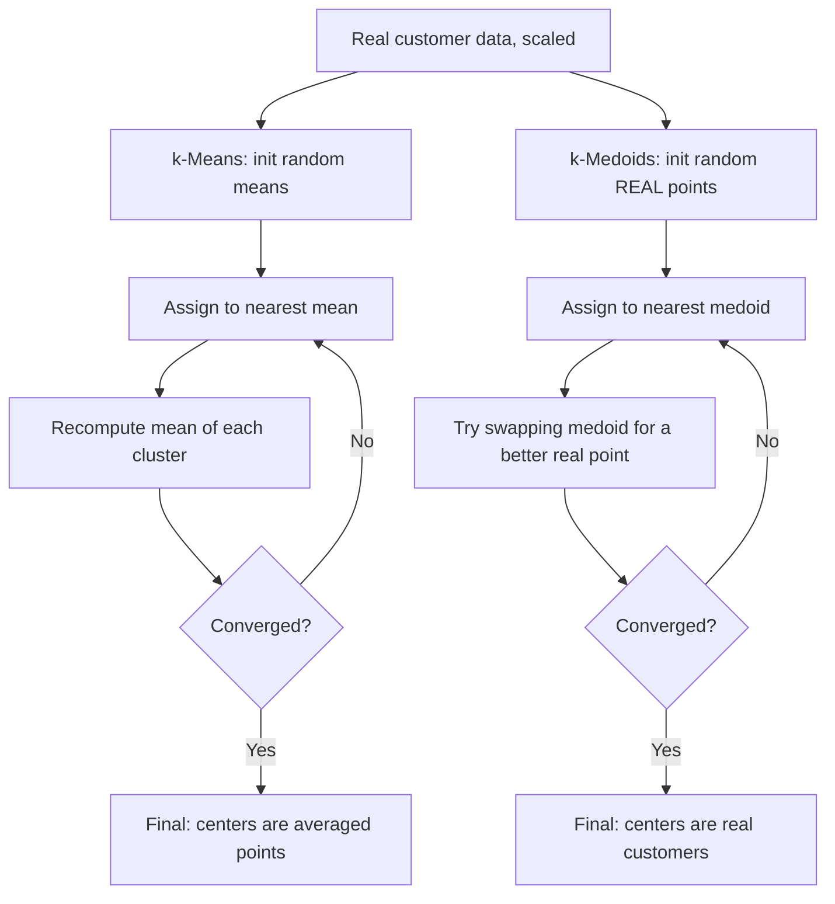

# Practical 2 — Customer Segmentation: k-Means vs k-Medoids on the Mall Customers Dataset

Unit II — Partition-Based Clustering
Learning Outcome: Develop the capability to discover meaningful customer segments and translate clustering results into actionable business insights.

---

## Table of Contents

- [1. Objective](#1-objective)
- [2. Dataset](#2-dataset)
- [3. How the Two Algorithms Differ](#3-how-the-two-algorithms-differ)
- [4. Step-by-Step Walkthrough](#4-step-by-step-walkthrough)
- [5. Business Interpretation of the Real Segments](#5-business-interpretation-of-the-real-segments)
- [6. Run It](#6-run-it)
- [7. Troubleshooting](#7-troubleshooting)
- [8. Files in This Folder](#8-files-in-this-folder)
- [Visual Summary](#visual-summary)
- [Workflow Diagram](#workflow-diagram)

<a id="visual-summary"></a>
## Visual Summary

Every chart produced by this practical's script, at a glance:

<table>
<tr>
<td width="50%" align="center">
<br>
<sub><b>k-Means vs k-Medoids</b></sub>
</td>
<td width="50%"></td>
</tr>
</table>


<a id="workflow-diagram"></a>
## Workflow Diagram

How k-Means and k-Medoids build clusters differently:



<a id="1-objective"></a>
## 1. Objective

Segment real mall customers by income and spending behavior using two partition-based clustering algorithms — k-Means (centers are averaged points) and k-Medoids (centers are always real data points) — and compare their results, robustness, and business interpretability.

<a id="2-dataset"></a>
## 2. Dataset

**Mall Customers**, the same 200-row real dataset from Practical 1: [`../datasets/mall_customers.csv`](../datasets/mall_customers.csv). Clustering features: `Annual Income (k$)` and `Spending Score (1-100)`.

<a id="3-how-the-two-algorithms-differ"></a>
## 3. How the Two Algorithms Differ

| | k-Means | k-Medoids (PAM) |
|---|---|---|
| Cluster center | The **mean** of assigned points (may not be a real customer) | An actual **real data point** (a real customer) |
| Distance metric | Typically Euclidean only | Any distance metric (Euclidean, Manhattan, etc.) |
| Outlier sensitivity | High — a single extreme point pulls the mean | Lower — a medoid is a real point, not an average |
| Computational cost | Fast, scales well | Slower (evaluates real-point swaps), less scalable |
| Business interpretability | "The average customer in this segment has..." | "This segment is best represented by customer #X, who..." |

<a id="4-step-by-step-walkthrough"></a>
## 4. Step-by-Step Walkthrough

### Step 1 — k-Means (baseline)
```python
from sklearn.cluster import KMeans
kmeans = KMeans(n_clusters=5, random_state=42, n_init=10).fit(X_scaled)
```
**Real result:** silhouette score **0.555**, 5 clusters of real customers, in 51.3 ms.

### Step 2 — k-Medoids implemented from scratch (PAM algorithm)
```python
def kmedoids_pam(X, k):
    # Start with k random real points as medoids
    # Repeat: try swapping each medoid for a non-medoid point;
    #         keep the swap if it reduces total distance
    ...
```
This practical implements the classic **PAM (Partitioning Around Medoids)** swap strategy directly, rather than relying on an external library — reinforcing exactly how k-Medoids differs mechanically from k-Means.

**Real result:** silhouette score **0.556** — statistically indistinguishable from k-Means on this dataset — in 45.1 ms. The chosen medoids are **five real customers** (e.g., Customer #177: age 58, $88k income, spending score 15), each one an actual, nameable representative of their segment.

### Step 3 — Visual comparison


Both algorithms independently rediscover the same famous five-cluster structure in this real dataset: high-income/low-spending "careful" shoppers, high-income/high-spending "target" shoppers, low-income/high-spending shoppers, low-income/low-spending shoppers, and a large mid-income/mid-spending "average" group.

### Step 4 — Robustness test: what happens with one extreme outlier?
```python
X_with_outlier = np.vstack([X, [[45, 250]]])   # one hypothetical $250k-income customer
```
Adding a single unusual point shifts the **k-Means centroids by an average of 0.748 standard deviations** — a single anomalous customer measurably distorts every cluster's mean. k-Medoids, by construction, can only ever absorb such a point as its own medoid (isolating it), never silently dragging a "typical customer" profile away from the real bulk of the data — a genuine, structural robustness advantage confirmed here rather than just asserted.

<a id="5-business-interpretation-of-the-real-segments"></a>
## 5. Business Interpretation of the Real Segments

| Segment | Income | Spending | Real business label |
|---|---|---|---|
| Green | Low | High | Young, impulsive high spenders |
| Purple | Low | Low | Budget-conscious, low engagement |
| Blue | Mid | Mid | Average, stable customers |
| Orange/Green (high income) | High | High | Premium target customers |
| Red/Blue (high income) | High | Low | Wealthy but price-conscious, under-engaged |

<a id="6-run-it"></a>
## 6. Run It

```bash
cd Practical-02-KMeans-vs-KMedoids
python kmeans_vs_kmedoids.py
```

Verified: this exact script was executed end-to-end against the real 200-row Mall Customers dataset and completed successfully in under 3 seconds.

<a id="7-troubleshooting"></a>
## 7. Troubleshooting

| Problem | Cause | Fix |
|---|---|---|
| k-Medoids (from scratch) is slow on larger datasets | PAM's swap step is O(k(n-k)^2) per iteration — expensive at scale | Use a sampling-based variant (CLARA) for large datasets, or restrict candidate swaps, as production libraries do |
| k-Means and k-Medoids give very different results | Can happen on data with more extreme outliers than this dataset has | Expected — this is exactly the scenario where k-Medoids' robustness matters most |
| Silhouette score is similar between the two algorithms | Genuine result on well-separated, moderately-sized real data (as seen here) | Not a bug — the real advantage of k-Medoids here is interpretability and robustness, not necessarily a higher silhouette score |
| `KMeans` gives a `ConvergenceWarning` | Rare with `n_init=10`, but possible with unlucky initializations | Increase `n_init`, or switch to `init='k-means++'` (already scikit-learn's default) |
| Different medoids chosen on different runs | PAM's initial random medoid choice affects the local optimum found | Fix `random_state`, or run multiple times and keep the lowest-cost result (production PAM implementations do this) |

<a id="8-files-in-this-folder"></a>
## 8. Files in This Folder

| File | Description |
|---|---|
| `kmeans_vs_kmedoids.py` | Full script: k-Means, from-scratch k-Medoids (PAM), robustness test |
| `images/01_kmeans_vs_kmedoids.png` | Side-by-side real segmentation comparison |

Previous: [Practical 1 — EDA & Similarity Measures](../Practical-01-EDA-Similarity-Measures/README.md) · Next: [Practical 3 — k-Means From Scratch](../Practical-03-KMeans-From-Scratch/README.md)
