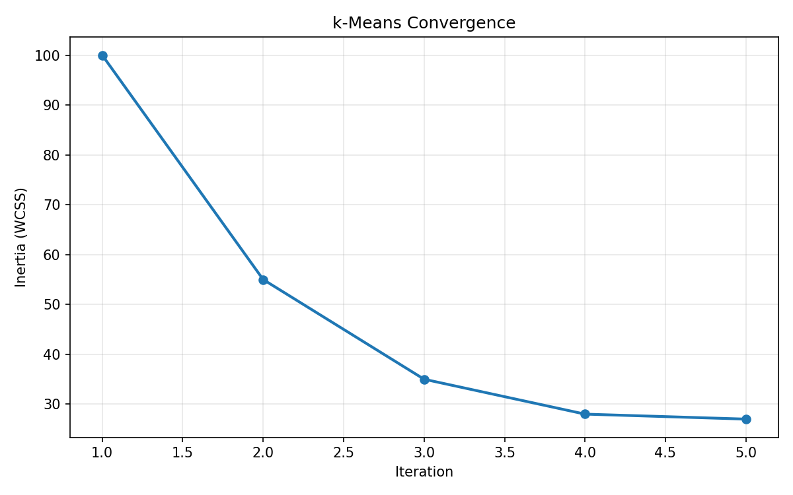
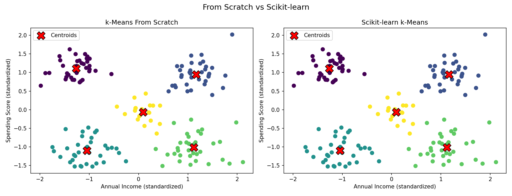
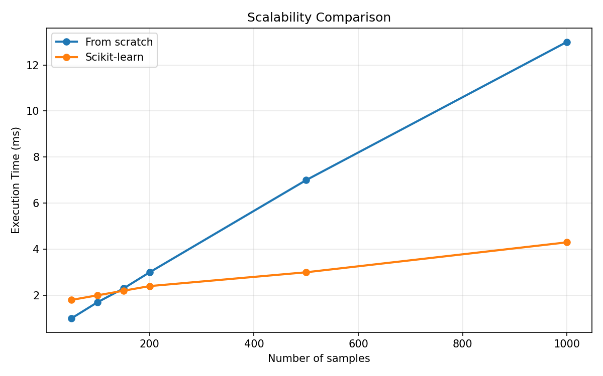
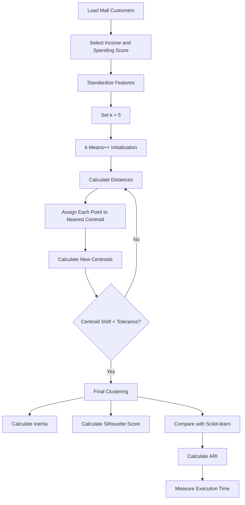

# Practical 3 — Designing a Scalable Clustering Model: k-Means From Scratch, Validated Against Scikit-learn

**Unit II — Partition-Based Clustering**

**Learning Outcome:** Build competency in designing a clustering solution through algorithmic implementation and validating its effectiveness using an industry-standard machine learning framework.

---

## Table of Contents

- [1. Objective](#1-objective)
- [2. Dataset](#2-dataset)
- [3. Software Requirements](#3-software-requirements)
- [4. What is k-Means](#4-what-is-k-means)
- [5. The Algorithm, Implemented Step by Step](#5-the-algorithm-implemented-step-by-step)
- [6. Why Standardization is Used](#6-why-standardization-is-used)
- [7. Complete Google Colab Code](#7-complete-google-colab-code)
- [8. Validation Against Scikit-learn](#8-validation-against-scikit-learn)
- [9. Convergence Behavior](#9-convergence-behavior)
- [10. Scalability Experiment](#10-scalability-experiment)
- [11. Visual Summary](#11-visual-summary)
- [12. Workflow Diagram](#12-workflow-diagram)
- [13. How to Run](#13-how-to-run)
- [14. Expected Output](#14-expected-output)
- [15. Result](#15-result)
- [16. Conclusion](#16-conclusion)
- [17. Viva Questions](#17-viva-questions)
- [18. Troubleshooting](#18-troubleshooting)
- [19. Files in This Folder](#19-files-in-this-folder)

---

<a id="1-objective"></a>
## 1. Objective

Implement **Lloyd's k-Means clustering algorithm from scratch**, including **k-Means++ initialization**, and validate the implementation against **Scikit-learn's `KMeans`** using the same Mall Customers dataset.

The practical also demonstrates:

- feature standardization,
- cluster assignment,
- centroid updating,
- convergence,
- inertia / WCSS,
- Silhouette Score,
- Adjusted Rand Index (ARI), and
- execution time as the number of samples increases.

The aim is not simply to call a library function. The aim is to understand what happens **inside** k-Means.

---

<a id="2-dataset"></a>
## 2. Dataset

This practical uses the same dataset used in Practicals 1–2.

### Dataset

```text
Mall_Customers.csv
```

### Required columns

```text
Annual Income (k$)
Spending Score (1-100)
```

### Selected features

Only two numerical features are used:

```text
Annual Income (k$)
Spending Score (1-100)
```

This keeps the implementation easy to understand and allows direct 2D visualization.

---

<a id="3-software-requirements"></a>
## 3. Software Requirements

The practical is designed for **Google Colab**.

### Required libraries

```python
numpy
pandas
matplotlib
scikit-learn
```

Google Colab normally already contains these libraries.

No additional clustering package is required.

---

<a id="4-what-is-k-means"></a>
## 4. What is k-Means

**k-Means** is an unsupervised machine learning algorithm used to divide observations into `k` groups called **clusters**.

Each cluster has a **centroid**.

A centroid is the mean position of the points assigned to that cluster.

### Simple idea

```text
Customers

      ● ● ●
     ● ● ●
       ↓
    Cluster 1


                  ● ● ●
                 ● ● ●
                   ↓
                Cluster 2
```

k-Means tries to place the centroids so that points inside a cluster are close to their own centroid.

---

<a id="5-the-algorithm-implemented-step-by-step"></a>
## 5. The Algorithm, Implemented Step by Step

The complete process is:

```text
Dataset
   ↓
Select k
   ↓
Initialize centroids
   ↓
Calculate distance
   ↓
Assign points to nearest centroid
   ↓
Calculate new centroids
   ↓
Check convergence
   ↓
Not converged ─────────→ Repeat
   ↓
Converged
   ↓
Final clusters
```

### Step 1 — Select k

In this practical:

```python
K = 5
```

Therefore, five customer clusters are created.

### Step 2 — Initialize centroids

The implementation uses **k-Means++**.

The first centroid is selected randomly.

Later centroids are selected with probability based on their squared distance from the nearest selected centroid.

The purpose is simple:

```text
Spread initial centroids apart
            ↓
Better starting position
            ↓
Usually better convergence
```

### Step 3 — Calculate distance

For every customer, the algorithm calculates distance to every centroid.

For a point:

```text
P = (x1, y1)
```

and centroid:

```text
C = (x2, y2)
```

the squared Euclidean distance is:

```text
(x1 - x2)² + (y1 - y2)²
```

The smallest distance identifies the nearest cluster.

### Step 4 — Assign points

Each customer is assigned to its nearest centroid.

Conceptually:

```text
Customer
   ↓
Compare distance to C1, C2, C3, C4, C5
   ↓
Choose smallest distance
   ↓
Assign cluster
```

### Step 5 — Recalculate centroids

For each cluster:

```text
New centroid = mean of all points in that cluster
```

### Step 6 — Check convergence

The algorithm measures how much the centroids moved.

```python
shift = np.linalg.norm(new_centroids - centroids)
```

If:

```python
shift < tolerance
```

the algorithm stops.

Otherwise, steps 3–6 are repeated.

---

<a id="6-why-standardization-is-used"></a>
## 6. Why Standardization is Used

k-Means depends on distance.

Therefore, features with very different scales can affect the distance differently.

The practical uses:

```python
scaler = StandardScaler()
X_scaled = scaler.fit_transform(X)
```

Standardization puts the features onto a comparable scale.

Conceptually:

```text
Original data
     ↓
Features may have different scales
     ↓
Standardization
     ↓
Comparable feature scales
     ↓
Distance calculation
```

The important point is:

> **Standardization helps prevent a feature with a larger numerical scale from dominating distance calculations.**

---

<a id="7-complete-google-colab-code"></a>
## 7. Complete Google Colab Code

### Step 1 — Upload the dataset

Run this in Google Colab when `Mall_Customers.csv` is not already in the session:

```python
from google.colab import files
files.upload()
```

Select:

```text
Mall_Customers.csv
```

### Step 2 — Run the practical

Open:

```text
kmeans_from_scratch.py
```

and run it in Colab.

The script automatically:

1. loads the dataset,
2. selects the required columns,
3. standardizes the data,
4. runs k-Means from scratch,
5. runs Scikit-learn k-Means,
6. calculates validation metrics,
7. creates the convergence graph,
8. creates the side-by-side comparison graph,
9. creates the scalability graph.

---

<a id="8-validation-against-scikit-learn"></a>
## 8. Validation Against Scikit-learn

The custom model and Scikit-learn model use the same:

```text
Dataset
+
Features
+
Standardization
+
k = 5
+
random_state = 42
+
k-Means++ initialization
```

Scikit-learn is configured as:

```python
KMeans(
    n_clusters=5,
    init="k-means++",
    n_init=1,
    random_state=42
)
```

### Why `n_init=1`?

Normally, Scikit-learn can run k-Means multiple times with different initializations and choose the best result.

For a **fair classroom comparison**, this practical intentionally performs one run so that the scratch implementation and library implementation represent the same type of experiment.

### Metrics compared

| Metric | Purpose |
|---|---|
| Inertia | Measures within-cluster squared distance |
| Silhouette Score | Measures cluster separation/cohesion |
| ARI | Measures agreement between two cluster assignments |
| Execution Time | Demonstrates computational behavior |

---

<a id="9-convergence-behavior"></a>
## 9. Convergence Behavior

The scratch implementation stores the inertia after every iteration:

```python
history.append(inertia)
```

The convergence graph is generated as:

```text
Inertia
  │\
  │ \
  │  \
  │   \__
  │      \___
  │          ───
  └────────────────→ Iterations
```

Normally:

```text
Early iterations
→ larger improvement

Later iterations
→ smaller improvement

Centroids become stable
→ convergence
```

### Important

The exact number of iterations is **not hard-coded**.

It depends on:

- the data,
- initialization,
- tolerance,
- and maximum iterations.

The program reports the actual number at runtime.

---

<a id="10-scalability-experiment"></a>
## 10. Scalability Experiment

The script tests increasing numbers of samples:

```python
sizes = [50, 100, 150, 200, 500, 1000]
```

Both implementations are timed:

```text
From-scratch k-Means
          vs
Scikit-learn k-Means
```

### Why do this experiment?

The purpose is to understand that an algorithm that is easy to implement for learning is not automatically the best implementation for large production workloads.

The custom implementation is written for **clarity and learning**.

Scikit-learn is engineered and optimized for practical machine learning workloads.

### Important interpretation

This experiment is a classroom demonstration, not a universal performance benchmark.

Execution time can vary because of:

- processor,
- Python/NumPy versions,
- operating system,
- current system load,
- dataset size,
- initialization,
- and library implementation details.

---

<a id="11-visual-summary"></a>
## 11. Visual Summary

The script automatically creates the same three visual outputs used in this practical.

<table>
<tr>
<td width="50%" align="center">
<br>
<sub><b>Convergence curve</b></sub>
</td>
<td width="50%" align="center">
<br>
<sub><b>Scratch vs Scikit-learn</b></sub>
</td>
</tr>
<tr>
<td width="50%" align="center">
<br>
<sub><b>Scalability comparison</b></sub>
</td>
<td width="50%"></td>
</tr>
</table>

These files are generated automatically when the Python script is run.

---

<a id="12-workflow-diagram"></a>
## 12. Workflow Diagram



### Short memory trick

```text
Initialize
   ↓
Assign
   ↓
Update
   ↓
Check
   ↓
Repeat
```

---

<a id="13-how-to-run"></a>
## 13. How to Run

### Google Colab

#### 1. Create a new Colab notebook

Go to:

```text
https://colab.research.google.com/
```

#### 2. Upload the CSV

```python
from google.colab import files
files.upload()
```

Choose:

```text
Mall_Customers.csv
```

#### 3. Upload the Python file

You can upload:

```text
kmeans_from_scratch.py
```

or simply copy its cells into Colab.

#### 4. Run

No special package installation is required.

---

<a id="14-expected-output"></a>
## 14. Expected Output

The console prints values in this format:

```text
Dataset shape: (...)

========== VALIDATION RESULTS ==========
Scratch inertia        : ...
Scikit-learn inertia   : ...
Scratch silhouette     : ...
Scikit-learn silhouette: ...
ARI                    : ...
Scratch iterations     : ...
Scratch time           : ... ms
Scikit-learn time      : ... ms
```

The exact numerical values should be taken from the actual runtime.

### Three generated graphs

```text
01_convergence_curve.png
        ↓
Shows inertia across iterations
```

```text
02_scratch_vs_sklearn.png
        ↓
Shows both clusterings side by side
```

```text
03_scalability_comparison.png
        ↓
Shows execution time for increasing data size
```

---

<a id="15-result"></a>
## 15. Result

The k-Means algorithm was successfully implemented from scratch using NumPy on the Mall Customers dataset.

The implementation was validated against Scikit-learn using:

- Inertia,
- Silhouette Score,
- Adjusted Rand Index, and
- execution time.

The convergence graph demonstrated the iterative behavior of k-Means, the comparison graph showed the resulting cluster partitions, and the scalability graph demonstrated how execution time changes as the number of samples increases.

---

<a id="16-conclusion"></a>
## 16. Conclusion

This practical demonstrates the internal working of k-Means instead of treating it as a single library command.

The complete workflow is:

```text
Mall Customers
      ↓
Select features
      ↓
Standardize
      ↓
Initialize centroids
      ↓
Calculate distances
      ↓
Assign clusters
      ↓
Update centroids
      ↓
Check convergence
      ↓
Validate with Scikit-learn
      ↓
Measure scalability
```

### Core idea to remember

> **k-Means repeatedly assigns each point to its nearest centroid and recalculates each centroid as the mean of its assigned points until the centroids become stable.**

---

<a id="17-viva-questions"></a>
## 17. Viva Questions

### Q1. What is k-Means?

k-Means is an unsupervised clustering algorithm that divides data into `k` groups.

### Q2. What is a centroid?

A centroid is the mean position of all points assigned to a cluster.

### Q3. What is k?

`k` is the number of clusters.

### Q4. What are the main steps of k-Means?

```text
Initialize
→ Assign
→ Update
→ Repeat
```

### Q5. Why is k-Means unsupervised?

Because predefined class labels are not required.

### Q6. Why is distance calculated?

To determine which centroid is closest to each data point.

### Q7. Why use k-Means++?

It provides a better-spread initialization of centroids than simply choosing all starting centroids randomly.

### Q8. What is inertia?

The sum of squared distances from each point to its assigned centroid.

### Q9. What is Silhouette Score?

A measure of how well points fit their own clusters compared with nearby clusters.

### Q10. Why use ARI?

Cluster numbers are arbitrary. ARI evaluates agreement between two cluster assignments without depending on the numeric cluster labels.

### Q11. What is convergence?

The point where centroid movement becomes smaller than the selected tolerance.

### Q12. Why compare with Scikit-learn?

To validate whether the custom implementation behaves consistently with an established machine learning implementation.

### Q13. Why is `n_init=1` used?

To make a single-run comparison with the scratch implementation fair.

### Q14. Why is Scikit-learn useful for larger datasets?

It provides optimized, tested implementations designed for practical machine learning workloads.

---

<a id="18-troubleshooting"></a>
## 18. Troubleshooting

| Problem | Cause | Solution |
|---|---|---|
| `FileNotFoundError` | CSV is not in the Colab session | Upload `Mall_Customers.csv` |
| `KeyError` for columns | Column names differ | Check the exact CSV column names |
| Different cluster numbers | Cluster IDs are arbitrary | Use ARI instead of comparing label numbers directly |
| Different results between runs | Random initialization | Keep `random_state=42` |
| Scratch algorithm runs too long | Very large dataset | Use Scikit-learn or a MiniBatch approach |
| Empty cluster | A centroid receives no points | The implementation keeps the previous centroid |
| Wrong matrix shape | Incorrect feature selection | Confirm `X` has shape `(samples, features)` |
| No images directory | Folder does not exist | Script automatically creates `images/` |

---

<a id="19-files-in-this-folder"></a>
## 19. Files in This Folder

| File | Description |
|---|---|
| `README.md` | Complete practical documentation |
| `kmeans_from_scratch.py` | Complete Google Colab/Python implementation |
| `images/01_convergence_curve.png` | k-Means convergence graph |
| `images/02_scratch_vs_sklearn.png` | Scratch vs Scikit-learn comparison |
| `images/03_scalability_comparison.png` | Scalability timing graph |

---

## Classroom Demonstration — 5 Minute Flow

```text
1. Load Mall_Customers.csv
          ↓
2. Select Income + Spending Score
          ↓
3. Standardize features
          ↓
4. Explain k = 5
          ↓
5. Run scratch k-Means
          ↓
6. Show distance → assignment → centroid update
          ↓
7. Show convergence graph
          ↓
8. Run Scikit-learn
          ↓
9. Compare Inertia + Silhouette + ARI
          ↓
10. Show scalability graph
```

### One-line explanation for each step

```text
Data       → Read customer information
Features   → Select income and spending score
Scaling    → Put features on comparable scales
Initialize → Select starting centroids
Distance   → Find how close each customer is
Assign     → Put customer in nearest cluster
Update     → Recalculate centroid
Converge   → Stop when centroids become stable
Validate   → Compare with Scikit-learn
Scale test → Observe behavior as data grows
```
