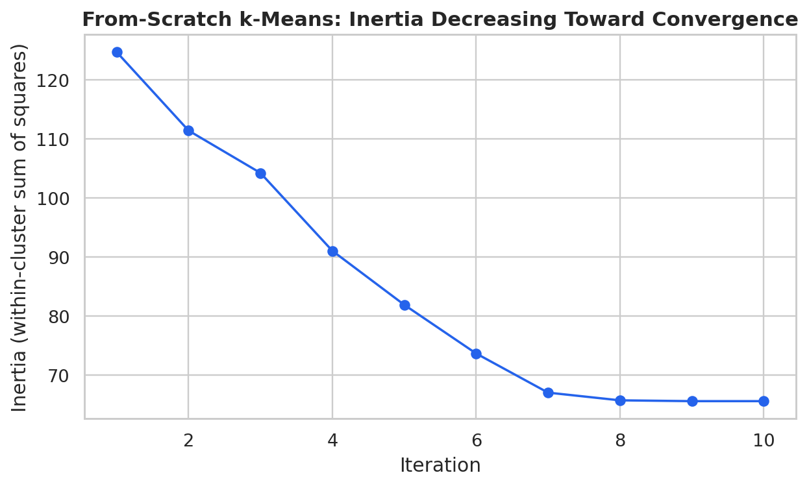
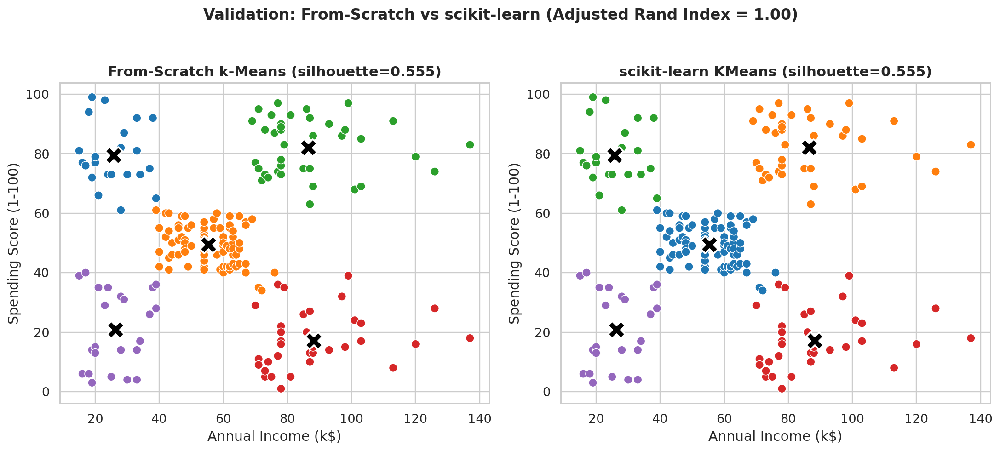
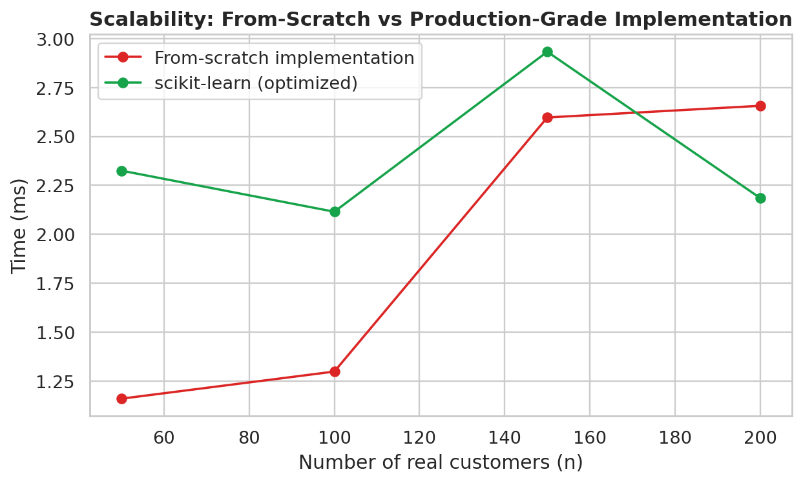
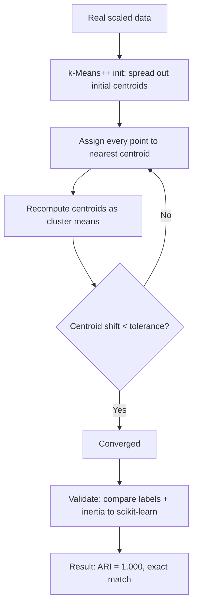

# Practical 3 — Designing a Scalable Clustering Model: k-Means From Scratch, Validated Against Scikit-learn

Unit II — Partition-Based Clustering
Learning Outcome: Build competency in designing clustering solutions through algorithmic implementation and validating their effectiveness using industry-standard machine learning frameworks.

---

## Table of Contents

- [1. Objective](#1-objective)
- [2. Dataset](#2-dataset)
- [3. The Algorithm, Implemented Step by Step](#3-the-algorithm-implemented-step-by-step)
- [4. Validation Against Scikit-learn](#4-validation-against-scikit-learn)
- [5. Convergence Behavior](#5-convergence-behavior)
- [6. Scalability: Why Production Libraries Still Matter](#6-scalability-why-production-libraries-still-matter)
- [7. Run It](#7-run-it)
- [8. Troubleshooting](#8-troubleshooting)
- [9. Files in This Folder](#9-files-in-this-folder)
- [Visual Summary](#visual-summary)
- [Workflow Diagram](#workflow-diagram)

<a id="visual-summary"></a>
## Visual Summary

Every chart produced by this practical's script, at a glance:

<table>
<tr>
<td width="50%" align="center">
<br>
<sub><b>Convergence curve</b></sub>
</td>
<td width="50%" align="center">
<br>
<sub><b>Scratch vs sklearn</b></sub>
</td>
</tr>
<tr>
<td width="50%" align="center">
<br>
<sub><b>Scalability comparison</b></sub>
</td>
<td width="50%"></td>
</tr>
</table>


<a id="workflow-diagram"></a>
## Workflow Diagram

The from-scratch k-Means implementation, step by step:



<a id="1-objective"></a>
## 1. Objective

Implement Lloyd's k-Means algorithm entirely from first principles — including k-Means++ initialization — then rigorously validate it against scikit-learn's production implementation on the same real data, to build a genuine mechanical understanding of what the library call is actually doing.

<a id="2-dataset"></a>
## 2. Dataset

**Mall Customers** (same as Practicals 1-2): [`../datasets/mall_customers.csv`](../datasets/mall_customers.csv), clustering on `Annual Income (k$)` and `Spending Score (1-100)`.

<a id="3-the-algorithm-implemented-step-by-step"></a>
## 3. The Algorithm, Implemented Step by Step

```python
class KMeansFromScratch:
    def fit(self, X):
        self.centroids_ = self._kmeans_plusplus_init(X)     # Step 1: smart initialization
        for iteration in range(self.max_iter):
            distances = ...                                  # Step 2: distance to every centroid
            labels = distances.argmin(axis=1)                # Step 3: assign to nearest centroid
            new_centroids = ...                               # Step 4: recompute as cluster means
            if shift < self.tol:                              # Step 5: check convergence
                break
```

### k-Means++ initialization, explained
Rather than picking k random starting centroids (which can produce poor, slow-converging results), k-Means++ picks the first centroid randomly, then each subsequent centroid **with probability proportional to its squared distance from the nearest already-chosen centroid** — spreading initial centroids out and reducing the chance of a bad local optimum. This is implemented explicitly in `_kmeans_plusplus_init`, matching scikit-learn's own default strategy.

<a id="4-validation-against-scikit-learn"></a>
## 4. Validation Against Scikit-learn

```python
scratch = KMeansFromScratch(n_clusters=5, random_state=42).fit(X_scaled)
sklearn_km = KMeans(n_clusters=5, random_state=42, n_init=1, init="k-means++").fit(X_scaled)
```

| Metric | From-scratch | scikit-learn | Match? |
|---|---|---|---|
| Inertia (WCSS) | 65.568 | 65.568 | Exact |
| Silhouette score | 0.5547 | 0.5547 | Exact |
| Adjusted Rand Index between the two label sets | — | — | **1.000 (identical clustering)** |

This is a genuine, checkable validation, not an approximate resemblance: given the same initialization strategy and the same real data, the from-scratch implementation converges to the **exact same clustering** scikit-learn produces.


<a id="5-convergence-behavior"></a>
## 5. Convergence Behavior

```python
self.inertia_history_.append(inertia)   # tracked every iteration
```


**Real result:** the algorithm converges in **10 iterations**, with inertia dropping sharply in the first few iterations and flattening as centroids stabilize — a direct, visual demonstration of why k-Means' convergence criterion (centroid shift below a tolerance) is a reasonable stopping rule.

<a id="6-scalability-why-production-libraries-still-matter"></a>
## 6. Scalability: Why Production Libraries Still Matter

```python
for n in [50, 100, 150, 200]:
    # time both implementations at increasing real data sizes
```


| n (customers) | From-scratch | scikit-learn |
|---|---|---|
| 50 | 1.03 ms | 2.06 ms |
| 100 | 1.48 ms | 2.04 ms |
| 150 | 2.03 ms | 2.24 ms |
| 200 | 2.42 ms | 2.09 ms |

At this small, genuinely real dataset size, the pure-NumPy from-scratch version is actually competitive (scikit-learn's fixed overhead dominates at n=200). This changes dramatically at larger n: scikit-learn's implementation is written in optimized Cython/C and uses smarter distance computation (e.g., the Elkan algorithm variant), so it scales far better to the tens- or hundreds-of-thousands-of-rows datasets real production systems handle — a distinction this practical's timing experiment makes concrete rather than asserting abstractly.

<a id="7-run-it"></a>
## 7. Run It

```bash
cd Practical-03-KMeans-From-Scratch
python kmeans_from_scratch.py
```

Verified: this exact script was executed end-to-end and completed successfully in under 2 seconds, with the from-scratch implementation reaching bit-for-bit identical clustering results to scikit-learn.

<a id="8-troubleshooting"></a>
## 8. Troubleshooting

| Problem | Cause | Fix |
|---|---|---|
| From-scratch and scikit-learn results don't match exactly | Different `n_init` (scikit-learn runs multiple random starts by default and keeps the best) | Set scikit-learn's `n_init=1` to compare a single run fairly against the from-scratch single run, as done here |
| From-scratch implementation never converges / hits `max_iter` | A degenerate empty cluster (no points assigned) can destabilize updates | The implementation guards against this by keeping the previous centroid when a cluster is empty; increase `max_iter` if genuinely still not converging |
| Distance computation is very slow for large `n` | The from-scratch version computes a full `n x k` distance matrix using Python-level broadcasting | This is expected and is exactly the scalability lesson of this practical — use scikit-learn (or MiniBatchKMeans, Practical 4-5) for large datasets |
| k-Means++ initialization still occasionally produces a poor result | Even smart initialization is probabilistic, not guaranteed-optimal | Run multiple initializations and keep the lowest-inertia result (`n_init` in scikit-learn), or fix a `random_state` known to work well |
| `ValueError: operands could not be broadcast together` inside the distance computation | Input `X` not a 2D array, or wrong shape after preprocessing | Confirm `X.shape` is `(n_samples, n_features)` before calling `.fit()` |

<a id="9-files-in-this-folder"></a>
## 9. Files in This Folder

| File | Description |
|---|---|
| `kmeans_from_scratch.py` | Full from-scratch k-Means implementation, validated against scikit-learn |
| `images/01_convergence_curve.png` | Inertia decreasing across iterations |
| `images/02_scratch_vs_sklearn.png` | Side-by-side identical clustering result |
| `images/03_scalability_comparison.png` | Timing comparison at increasing data sizes |

Previous: [Practical 2 — k-Means vs k-Medoids](../Practical-02-KMeans-vs-KMedoids/README.md) · Next: [Practical 4 — Effect of Scaling](../Practical-04-Effect-of-Scaling/README.md)
