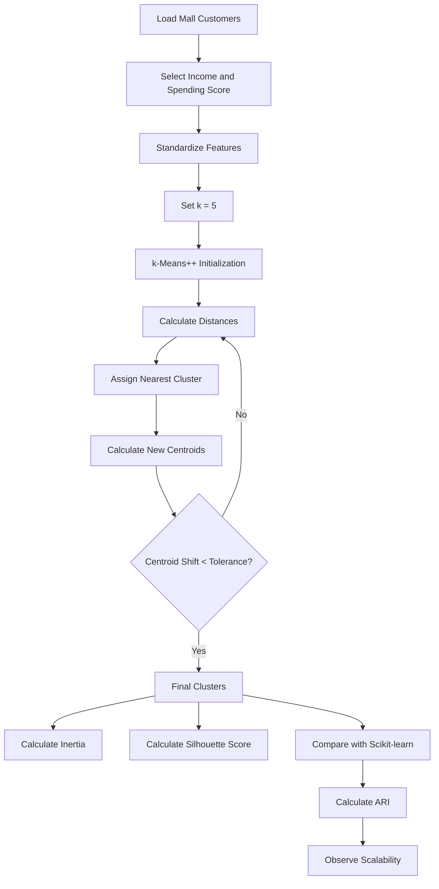

# Practical 3 — Designing a Scalable Clustering Model: k-Means From Scratch, Validated Against Scikit-learn

**Unit II — Partition-Based Clustering**

**Learning Outcome:** Build competency in designing a clustering solution by implementing k-Means from first principles and validating it with an industry-standard machine learning library.

---

## Table of Contents

- [1. Aim](#1-aim)
- [2. Learning Objectives](#2-learning-objectives)
- [3. Dataset](#3-dataset)
- [4. Software Requirements](#4-software-requirements)
- [5. What is k-Means](#5-what-is-k-means)
- [6. Working of the Algorithm](#6-working-of-the-algorithm)
- [7. Why Standardization is Used](#7-why-standardization-is-used)
- [8. Complete Google Colab Code](#8-complete-google-colab-code)
- [9. Step-by-Step Code Explanation](#9-step-by-step-code-explanation)
- [10. Validation Against Scikit-learn](#10-validation-against-scikit-learn)
- [11. Evaluation Metrics](#11-evaluation-metrics)
- [12. Convergence Behavior](#12-convergence-behavior)
- [13. Scalability Experiment](#13-scalability-experiment)
- [14. Expected Output](#14-expected-output)
- [15. Algorithm Flow](#15-algorithm-flow)
- [16. Result](#16-result)
- [17. Conclusion](#17-conclusion)
- [18. Viva Questions](#18-viva-questions)
- [19. Troubleshooting](#19-troubleshooting)
- [20. Files](#20-files)

---

<a id="1-aim"></a>
## 1. Aim

To implement the **k-Means clustering algorithm from scratch**, including **k-Means++ initialization**, and validate the implementation against **Scikit-learn's KMeans** using the Mall Customers dataset.

The practical also observes:

- convergence of k-Means,
- clustering quality using Silhouette Score,
- agreement between two implementations using Adjusted Rand Index (ARI), and
- execution time as the number of samples increases.

---

<a id="2-learning-objectives"></a>
## 2. Learning Objectives

After completing this practical, a student should be able to:

1. Explain the basic working of k-Means clustering.
2. Calculate distances between data points and centroids.
3. Assign points to the nearest centroid.
4. Recalculate centroids using the mean of each cluster.
5. Understand convergence and stopping conditions.
6. Implement k-Means without using a ready-made clustering function.
7. Validate a custom implementation using Scikit-learn.
8. Interpret inertia, Silhouette Score, and ARI.
9. Understand why production libraries are preferred for larger datasets.

---

<a id="3-dataset"></a>
## 3. Dataset

The practical uses the **Mall Customers** dataset.

### File

```text
Mall_Customers.csv
```

### Required columns

```text
Annual Income (k$)
Spending Score (1-100)
```

### Selected features

Only these two numerical features are used:

```text
X = [
    Annual Income (k$),
    Spending Score (1-100)
]
```

This keeps the practical simple and makes the clusters easy to visualize.

---

<a id="4-software-requirements"></a>
## 4. Software Requirements

The practical is designed for **Google Colab**.

### Required libraries

```python
numpy
pandas
matplotlib
scikit-learn
```

Install is normally unnecessary in Google Colab because these packages are already available.

---

<a id="5-what-is-k-means"></a>
## 5. What is k-Means

**k-Means** is an unsupervised machine learning algorithm that divides data into `k` groups called clusters.

Each cluster has a **centroid**.

The centroid represents the average location of the points belonging to that cluster.

### Simple example

Suppose we have:

```text
A  B  C          D  E  F
●  ●  ●          ●  ●  ●
 \ | /            \ | /
 Cluster 1        Cluster 2
```

k-Means tries to place one centroid in each natural group.

---

<a id="6-working-of-the-algorithm"></a>
## 6. Working of the Algorithm

The complete process is:

```text
Dataset
   ↓
Select k
   ↓
Choose initial centroids
   ↓
Calculate distance
   ↓
Assign each point to nearest centroid
   ↓
Calculate new centroids
   ↓
Check convergence
   ↓
Not converged ──→ Repeat assignment + update
   ↓
Converged
   ↓
Final clusters
```

### Step 1 — Choose k

Here:

```python
k = 5
```

This means the customers are divided into five clusters.

### Step 2 — Initialize centroids

The practical uses **k-Means++** initialization.

It spreads the starting centroids instead of choosing all of them randomly from nearby points.

### Step 3 — Calculate distance

For every customer, the squared Euclidean distance to every centroid is calculated.

For two points:

```text
P = (x1, y1)
C = (x2, y2)
```

the squared distance is:

```text
(x1 - x2)^2 + (y1 - y2)^2
```

The smallest distance determines the cluster.

### Step 4 — Assign clusters

Each customer is assigned to the nearest centroid.

### Step 5 — Recalculate centroids

For every cluster:

```text
new centroid = mean of all points in the cluster
```

### Step 6 — Check convergence

The movement of all centroids is calculated.

If the movement is smaller than the tolerance:

```python
shift < tol
```

the algorithm stops.

Otherwise, the assignment and update steps repeat.

---

<a id="7-why-standardization-is-used"></a>
## 7. Why Standardization is Used

k-Means is a **distance-based** algorithm.

Features with larger numerical scales can influence the distance more strongly.

Therefore, the practical standardizes the two selected features before clustering.

```python
scaler = StandardScaler()
X_scaled = scaler.fit_transform(X)
```

Standardization transforms each feature approximately to:

```text
mean = 0
standard deviation = 1
```

The important idea is not to memorize the code only.

Remember:

```text
Different scales
      ↓
Unequal influence on distance
      ↓
Standardization
      ↓
More balanced distance calculation
```

---

<a id="8-complete-google-colab-code"></a>
## 8. Complete Google Colab Code

### Step 1 — Upload the dataset

Run this only when the CSV is not already present in Colab:

```python
from google.colab import files
files.upload()
```

Select:

```text
Mall_Customers.csv
```

### Step 2 — Run the complete practical

The full code is provided in:

```text
kmeans_from_scratch.py
```

The same code can also be copied cell-by-cell into Google Colab.

---

<a id="9-step-by-step-code-explanation"></a>
## 9. Step-by-Step Code Explanation

### Import libraries

```python
import time
import numpy as np
import pandas as pd
import matplotlib.pyplot as plt
from sklearn.cluster import KMeans
from sklearn.metrics import silhouette_score, adjusted_rand_score
from sklearn.preprocessing import StandardScaler
```

Purpose:

| Library | Use |
|---|---|
| NumPy | Numerical calculations |
| Pandas | Read and handle dataset |
| Matplotlib | Graphs |
| Scikit-learn KMeans | Validation |
| Silhouette Score | Cluster quality |
| ARI | Compare two clusterings |
| StandardScaler | Feature standardization |

### Load data

```python
df = pd.read_csv("Mall_Customers.csv")

X = df[[
    "Annual Income (k$)",
    "Spending Score (1-100)"
]].values
```

`X` is the numerical matrix used by the algorithm.

### Standardize data

```python
scaler = StandardScaler()
X_scaled = scaler.fit_transform(X)
```

### Implement k-Means

The custom function performs four main operations repeatedly:

```text
1. Initialize centroids
2. Calculate distances
3. Assign clusters
4. Recalculate centroids
```

The implementation also:

- uses k-Means++,
- records inertia after every iteration,
- handles empty clusters safely, and
- stops when centroid movement becomes very small.

### Run scratch implementation

```python
scratch_labels, scratch_centroids, history = kmeans_scratch(
    X_scaled, k=5, random_state=42
)
```

### Run Scikit-learn

```python
model = KMeans(
    n_clusters=5,
    init="k-means++",
    n_init=1,
    random_state=42
)

sklearn_labels = model.fit_predict(X_scaled)
```

`n_init=1` is intentionally used for a fair single-run comparison with the custom implementation.

---

<a id="10-validation-against-scikit-learn"></a>
## 10. Validation Against Scikit-learn

Two implementations are run on exactly the same standardized data:

```text
                Same X_scaled
                     │
          ┌──────────┴──────────┐
          ↓                     ↓
   From-scratch              Scikit-learn
      k-Means                   KMeans
          │                     │
          └──────────┬──────────┘
                     ↓
                 Compare
```

The following are compared:

```text
Inertia
Silhouette Score
Cluster agreement (ARI)
Execution time
```

### Why not compare raw cluster numbers directly?

Suppose one implementation names clusters:

```text
0, 1, 2, 3, 4
```

and another names the exact same groups:

```text
3, 0, 4, 1, 2
```

The numbers are different, but the grouping may still be identical.

Therefore, **ARI** is used to compare the actual partitioning.

---

<a id="11-evaluation-metrics"></a>
## 11. Evaluation Metrics

### 11.1 Inertia / WCSS

Inertia is the total squared distance of every data point from its assigned centroid.

Lower inertia generally means points are closer to their cluster centroids.

```text
Inertia ↓
    |
    |   ●
    |     ●
    |       ●
    |          ●
    +----------------→ iterations
```

### 11.2 Silhouette Score

Silhouette Score measures how well each point fits its own cluster compared with other clusters.

Its range is approximately:

```text
-1 to +1
```

Interpretation:

```text
Near +1  → well separated clusters
Near  0  → overlapping / boundary points
Below 0  → possible incorrect clustering
```

### 11.3 Adjusted Rand Index (ARI)

ARI measures how closely two cluster assignments agree.

For this practical:

```text
ARI ≈ 1
```

means the scratch implementation and Scikit-learn produced essentially the same partition.

---

<a id="12-convergence-behavior"></a>
## 12. Convergence Behavior

The custom implementation stores inertia after every iteration:

```python
history.append(inertia)
```

Then the practical plots the values.

A typical curve looks like:

```text
Inertia
  │\
  │ \
  │  \
  │   \__
  │      \___
  │          ───
  └────────────────→ Iteration
```

The important observation is:

```text
First iterations
→ large improvement

Later iterations
→ small improvement

Centroids stop moving significantly
→ convergence
```

The exact number of iterations can vary because initialization and numerical conditions affect convergence.

Therefore, the code should **measure the result at runtime rather than hard-code a claim such as "always 10 iterations."**

---

<a id="13-scalability-experiment"></a>
## 13. Scalability Experiment

The practical repeats clustering with increasing numbers of samples:

```python
sizes = [50, 100, 150, 200, 500, 1000]
```

Execution time is measured for:

```text
From-scratch implementation
          vs
Scikit-learn implementation
```

### Important observation

Do not conclude from a tiny dataset that one implementation is universally faster.

For small datasets, setup overhead can make timings look unusual.

As data becomes larger, optimized production implementations generally have significant advantages in:

- low-level numerical operations,
- memory handling,
- optimized distance calculations,
- initialization,
- convergence handling, and
- overall engineering.

The experiment is therefore used to demonstrate the **idea of scalability**, not to claim a universal benchmark from the small Mall Customers dataset.

---

<a id="14-expected-output"></a>
## 14. Expected Output

The practical produces four main outputs.

### 1. Dataset information

```text
Dataset shape: (number_of_rows, 2)
```

### 2. Numerical validation results

Example format:

```text
========== RESULTS ==========
Scratch inertia       : ...
Scikit-learn inertia   : ...
Scratch silhouette     : ...
Scikit-learn silhouette: ...
ARI (label agreement)  : ...
Scratch iterations     : ...
Scratch time           : ... ms
Scikit-learn time      : ... ms
```

The exact values depend on the dataset file and runtime environment.

### 3. Convergence graph

Shows inertia decreasing as iterations proceed.

### 4. Cluster comparison

Two side-by-side plots:

```text
From Scratch       Scikit-learn
     ●                  ●
  ●  X  ●            ●  X  ●
     ●                  ●
```

They should show the same or extremely similar customer grouping when the same initialization is used.

### 5. Scalability graph

Shows execution time as the number of input samples increases.

---

<a id="15-algorithm-flow"></a>
## 15. Algorithm Flow



---

<a id="16-result"></a>
## 16. Result

The k-Means clustering algorithm was successfully implemented from scratch using NumPy and tested on the Mall Customers dataset.

The custom implementation was then validated against Scikit-learn using:

- Inertia,
- Silhouette Score,
- Adjusted Rand Index, and
- execution time.

The convergence graph demonstrates the iterative nature of k-Means, while the scalability experiment illustrates why optimized machine learning libraries are preferred for larger real-world datasets.

---

<a id="17-conclusion"></a>
## 17. Conclusion

This practical demonstrates the complete working of k-Means rather than treating it as a single library command.

The main learning sequence is:

```text
Data
 ↓
Standardization
 ↓
Centroid Initialization
 ↓
Distance Calculation
 ↓
Cluster Assignment
 ↓
Centroid Update
 ↓
Convergence
 ↓
Validation
 ↓
Scalability
```

The most important concept to remember is:

> **k-Means repeatedly assigns each point to the nearest centroid and then moves each centroid to the mean of its assigned points until the solution converges.**

---

<a id="18-viva-questions"></a>
## 18. Viva Questions

### Basic

**1. What is k-Means?**  
An unsupervised clustering algorithm that divides data into `k` clusters.

**2. What is a centroid?**  
The mean position of all points belonging to a cluster.

**3. What is k?**  
The number of clusters required.

**4. Why is k-Means called unsupervised?**  
Because the training data does not contain predefined class labels.

### Algorithm

**5. What are the main steps of k-Means?**

```text
Initialize
→ Assign
→ Update
→ Repeat
```

**6. Why calculate Euclidean distance?**  
To measure how close a point is to each centroid.

**7. What is convergence?**  
The point at which centroid movement becomes smaller than the chosen tolerance.

**8. Why use k-Means++?**  
It chooses better-spread initial centroids and often improves convergence compared with simple random initialization.

### Validation

**9. What is inertia?**  
The sum of squared distances between points and their assigned centroids.

**10. What is Silhouette Score?**  
A measure of how well points fit within their own cluster compared with neighboring clusters.

**11. Why use ARI?**  
Because cluster labels are arbitrary. ARI compares the actual grouping rather than the numeric names of clusters.

**12. Why set `n_init=1` for the Scikit-learn comparison?**  
To compare one Scikit-learn run with one scratch run under the same initialization strategy.

### Scalability

**13. Why should we use Scikit-learn in production?**  
Production libraries contain highly optimized and tested implementations designed to work efficiently at larger scales.

---

<a id="19-troubleshooting"></a>
## 19. Troubleshooting

| Problem | Solution |
|---|---|
| `FileNotFoundError` | Upload `Mall_Customers.csv` to Colab first |
| Column not found | Check the exact column names |
| Scratch and Scikit-learn labels look different | Use ARI; cluster IDs can be permuted |
| Results differ slightly | Confirm the same `random_state`, `k-means++`, and `n_init=1` |
| Empty-cluster issue | The scratch implementation keeps the previous centroid when a cluster becomes empty |
| Very slow large dataset | Use Scikit-learn or MiniBatchKMeans for large data |
| `X` shape problem | Confirm `X.shape` is `(samples, features)` |

---

<a id="20-files"></a>
## 20. Files

| File | Description |
|---|---|
| `README.md` | Complete practical documentation |
| `kmeans_from_scratch.py` | Short, complete implementation for Colab/Python |

---

## One-Minute Classroom Explanation

Use this sequence while demonstrating:

```text
1. Load Mall Customers
2. Select Income + Spending Score
3. Standardize the two features
4. Set k = 5
5. Pick initial centroids using k-Means++
6. Calculate distance
7. Assign each customer to nearest centroid
8. Recalculate centroid
9. Repeat until centroid movement is very small
10. Compare with Scikit-learn
11. Check Inertia, Silhouette Score and ARI
12. Observe convergence and execution time
```

### The easiest sentence to remember

**"Assign points to the nearest centroid, calculate the new mean centroid, and repeat until the centroids stop moving significantly."**
