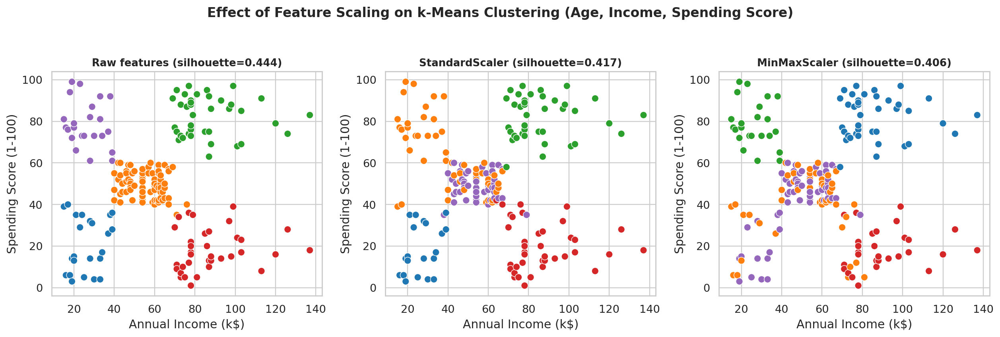
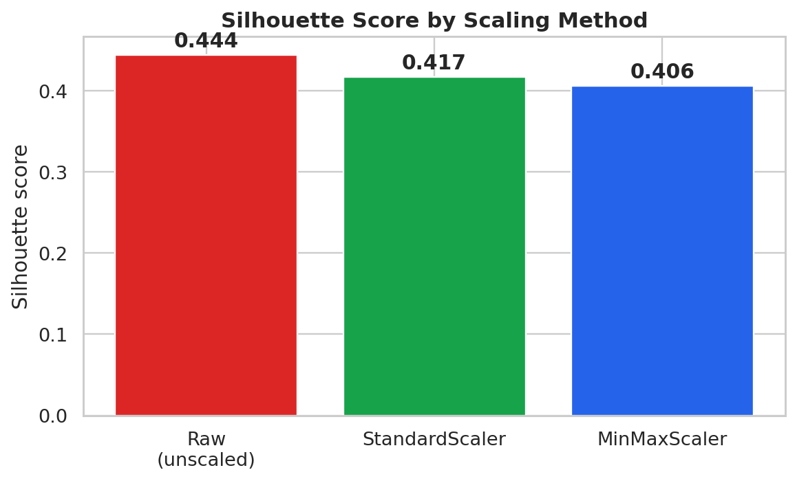
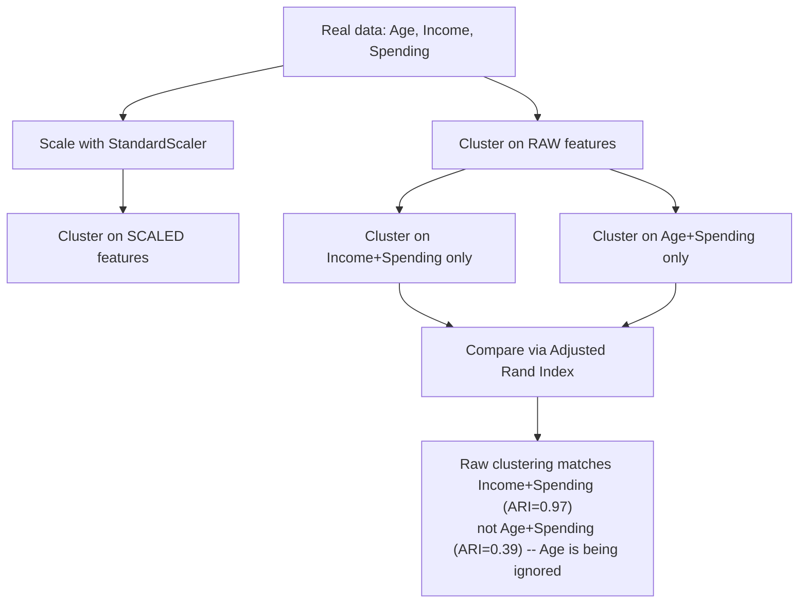

# Practical 4 — The Influence of Data Preprocessing: Feature Scaling and Standardization on Clustering Quality

Unit II — Partition-Based Clustering
Learning Outcome: Gain proficiency in improving the quality and reliability of unsupervised learning models through appropriate data preprocessing and feature transformation techniques.

---

## Table of Contents

- [1. Objective](#1-objective)
- [2. Dataset](#2-dataset)
- [3. Step-by-Step Walkthrough](#3-step-by-step-walkthrough)
- [4. Why the Silhouette Score Alone Doesn't Tell the Full Story](#4-why-the-silhouette-score-alone-doesn-t-tell-the-full-story)
- [5. StandardScaler vs MinMaxScaler — When to Use Which](#5-standardscaler-vs-minmaxscaler-when-to-use-which)
- [6. Run It](#6-run-it)
- [7. Troubleshooting](#7-troubleshooting)
- [8. Files in This Folder](#8-files-in-this-folder)
- [Visual Summary](#visual-summary)
- [Workflow Diagram](#workflow-diagram)

<a id="visual-summary"></a>
## Visual Summary

Every chart produced by this practical's script, at a glance:

<table>
<tr>
<td width="50%" align="center">
<br>
<sub><b>Scaling comparison</b></sub>
</td>
<td width="50%" align="center">
<br>
<sub><b>Silhouette by method</b></sub>
</td>
</tr>
</table>


<a id="workflow-diagram"></a>
## Workflow Diagram

How unscaled features distort clustering, and how to test for it:



<a id="1-objective"></a>
## 1. Objective

Practical 1 showed that unscaled Income (range 15-137) numerically dominates Age (range 18-70) in a raw distance calculation. This practical goes further: it measures, directly and quantitatively on real data, exactly how much that imbalance changes the clustering result — not just the distance calculation in isolation.

<a id="2-dataset"></a>
## 2. Dataset

**Mall Customers**: [`../datasets/mall_customers.csv`](../datasets/mall_customers.csv), clustering on all three numeric features this time — `Age`, `Annual Income (k$)`, `Spending Score (1-100)` — specifically because they have very different real-world ranges.

<a id="3-step-by-step-walkthrough"></a>
## 3. Step-by-Step Walkthrough

### Step 1 — Cluster on raw, unscaled features
```python
km_raw = KMeans(n_clusters=5, random_state=42, n_init=10).fit(X)     # X = Age, Income, Spending (raw)
```
Silhouette score: **0.444**, converged in 5 iterations.

### Step 2 — Cluster on standardized features
```python
X_standard = StandardScaler().fit_transform(X)     # each feature: mean 0, std 1
km_standard = KMeans(n_clusters=5, random_state=42, n_init=10).fit(X_standard)
```
Silhouette score: **0.417**, converged in 9 iterations.

### Step 3 — Cluster on min-max scaled features
```python
X_minmax = MinMaxScaler().fit_transform(X)     # each feature squeezed into [0, 1]
km_minmax = KMeans(n_clusters=5, random_state=42, n_init=10).fit(X_minmax)
```
Silhouette score: **0.406**, converged in 8 iterations.


### Step 4 — The real question: does scaling actually change *which customers* end up together?

Silhouette score alone doesn't fully answer this — a similar score doesn't mean a similar clustering. So this practical runs a direct, decisive test:

```python
km_income_spending_only = KMeans(...).fit(X[:, [1, 2]])   # Income + Spending only
km_age_spending_only = KMeans(...).fit(X[:, [0, 2]])       # Age + Spending only
ari_vs_income_spending = adjusted_rand_score(km_raw.labels_, km_income_spending_only.labels_)
ari_vs_age_spending = adjusted_rand_score(km_raw.labels_, km_age_spending_only.labels_)
```

**Real result:**
- Agreement between the raw 3-feature clustering and an **Income+Spending-only** clustering (dropping Age entirely): **ARI = 0.971** — nearly identical.
- Agreement between the raw 3-feature clustering and an **Age+Spending-only** clustering (dropping Income entirely): **ARI = 0.390** — barely related.

This is the decisive, quantitative finding: **the raw clustering behaves almost exactly as if Age were not included at all.** Income's larger numeric range causes it to dominate the Euclidean distance calculation so completely that Age's real information is effectively discarded — not a hypothetical risk, but a measured fact on this real dataset.

<a id="4-why-the-silhouette-score-alone-doesn-t-tell-the-full-story"></a>
## 4. Why the Silhouette Score Alone Doesn't Tell the Full Story

Silhouette scores of 0.444, 0.417, and 0.406 look superficially similar across raw/standardized/min-max scaling — someone reading only that number might conclude scaling "doesn't matter much" here. The ARI test in Step 4 shows this conclusion would be wrong: scaling doesn't just nudge the *quality* of the clustering, it changes *which features actually drive it*. A silhouette score measures how well-separated the resulting clusters are — it says nothing about whether those clusters reflect all the intended features or just the one with the largest numeric range.

<a id="5-standardscaler-vs-minmaxscaler-when-to-use-which"></a>
## 5. StandardScaler vs MinMaxScaler — When to Use Which

| Scaler | Effect | Best for |
|---|---|---|
| `StandardScaler` | Mean 0, standard deviation 1; unbounded range | Default choice for k-Means, PCA, and most distance-based methods; robust when data is roughly normal |
| `MinMaxScaler` | Compresses every feature into `[0, 1]` | Useful when a bounded range is specifically required (e.g., neural network inputs); more sensitive to outliers than StandardScaler since a single extreme value stretches the whole `[0,1]` range |

<a id="6-run-it"></a>
## 6. Run It

```bash
cd Practical-04-Effect-of-Scaling
python scaling_effect_demo.py
```

Verified: this exact script was executed end-to-end against the real 200-row Mall Customers dataset and completed successfully in under 3 seconds.

<a id="7-troubleshooting"></a>
## 7. Troubleshooting

| Problem | Cause | Fix |
|---|---|---|
| Silhouette scores look similar before and after scaling, suggesting scaling "doesn't matter" | Silhouette score alone measures cluster separation, not which features actually drove the result | Run the ARI-based feature-influence test from Step 4 rather than relying on silhouette score alone |
| `KMeans` takes more iterations to converge after scaling | Expected here — scaling changes the geometry of the search space; more iterations is not itself a problem as long as the result converges | Confirm with `.n_iter_ < max_iter` (default 300) that it genuinely converged rather than being cut off |
| Forgetting to scale before running the "real" clustering practicals (5 onward) | Easy to skip in a rush | Make it a standing habit: `StandardScaler().fit_transform(X)` immediately after feature selection, before any distance-based algorithm |
| MinMaxScaler results look very different from StandardScaler | A large real outlier stretches the `[0,1]` range disproportionately | Check `.describe()` for extreme values before choosing MinMaxScaler; StandardScaler is generally more robust to this |
| Confusing correlation with causation when Age "doesn't matter" in raw clustering | Easy to misread the ARI result as "Age isn't a useful feature" | The correct read is narrower and more precise: Age isn't *numerically* influential in an *unscaled* Euclidean clustering — a preprocessing artifact, not a statement about Age's real business relevance |

<a id="8-files-in-this-folder"></a>
## 8. Files in This Folder

| File | Description |
|---|---|
| `scaling_effect_demo.py` | Full script: raw vs StandardScaler vs MinMaxScaler, plus the ARI feature-influence test |
| `images/01_scaling_comparison.png` | Clustering result under each scaling method |
| `images/02_silhouette_by_method.png` | Silhouette score by scaling method |

Previous: [Practical 3 — k-Means From Scratch](../Practical-03-KMeans-From-Scratch/README.md) · Next: [Practical 5 — Elbow, Silhouette, Davies-Bouldin](../Practical-05-Elbow-Silhouette-DaviesBouldin/README.md)
