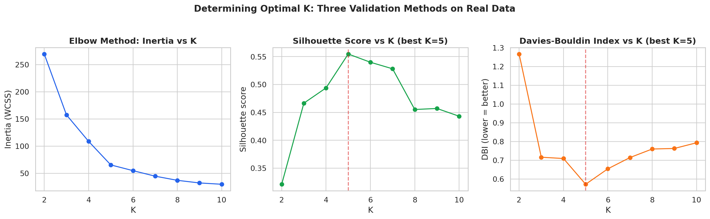
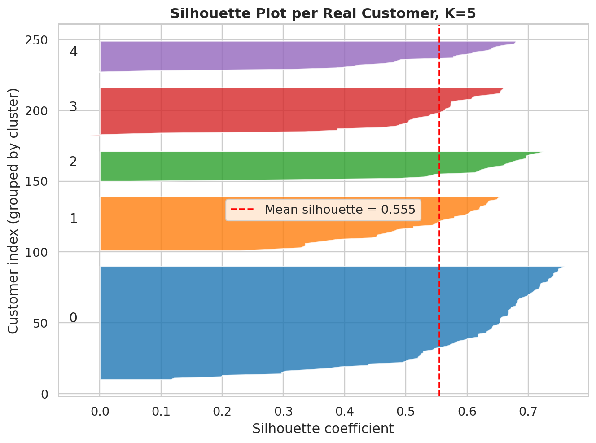
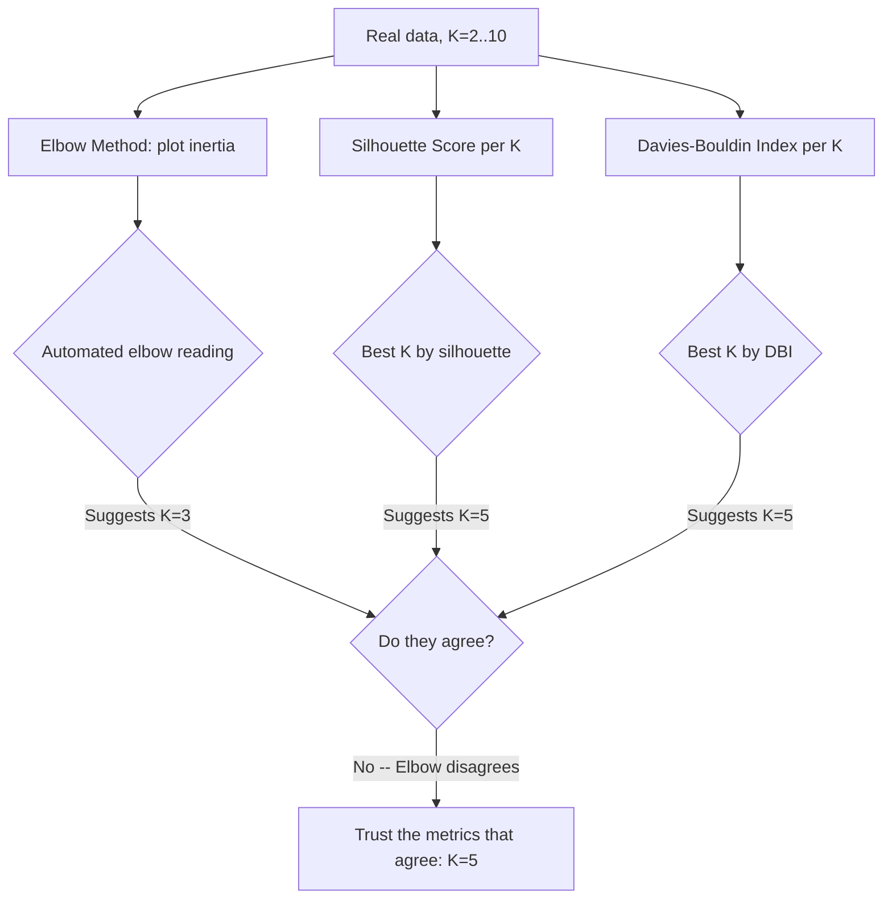

# Practical 5 — Determining the Optimal Clustering Configuration: Elbow Method, Silhouette Score, and Davies-Bouldin Index

Unit II — Partition-Based Clustering
Learning Outcome: Develop the ability to evaluate multiple clustering solutions and justify the selection of the most suitable model using objective validation measures.

---

## Table of Contents

- [1. Objective](#1-objective)
- [2. Dataset](#2-dataset)
- [3. Three Validation Methods, Explained](#3-three-validation-methods-explained)
- [4. Step-by-Step Walkthrough](#4-step-by-step-walkthrough)
- [5. Practical Guidance: How to Actually Choose K](#5-practical-guidance-how-to-actually-choose-k)
- [6. Run It](#6-run-it)
- [7. Troubleshooting](#7-troubleshooting)
- [8. Files in This Folder](#8-files-in-this-folder)
- [Visual Summary](#visual-summary)
- [Workflow Diagram](#workflow-diagram)

<a id="visual-summary"></a>
## Visual Summary

Every chart produced by this practical's script, at a glance:

<table>
<tr>
<td width="50%" align="center">
<br>
<sub><b>Three validation methods</b></sub>
</td>
<td width="50%" align="center">
<br>
<sub><b>Silhouette plot</b></sub>
</td>
</tr>
</table>


<a id="workflow-diagram"></a>
## Workflow Diagram

Triangulating three validation methods to choose K:



<a id="1-objective"></a>
## 1. Objective

Choosing K (the number of clusters) is one of the most consequential decisions in partition-based clustering, and no single method is fully reliable on its own. This practical applies three validation methods to the same real marketing dataset and — critically — shows a real case where they disagree, directly demonstrating the syllabus-named "Elbow Method pitfall."

<a id="2-dataset"></a>
## 2. Dataset

**Mall Customers**, used as the real-world marketing dataset: [`../datasets/mall_customers.csv`](../datasets/mall_customers.csv), clustering on `Annual Income (k$)` and `Spending Score (1-100)`.

<a id="3-three-validation-methods-explained"></a>
## 3. Three Validation Methods, Explained

| Method | What it measures | Direction |
|---|---|---|
| **Elbow Method (Inertia/WCSS)** | Within-cluster sum of squared distances — always decreases as K increases | Look for the point where the rate of decrease sharply slows |
| **Silhouette Score** | For each point: how much closer it is to its own cluster than to the nearest other cluster, averaged over all points | Range -1 to 1; higher is better |
| **Davies-Bouldin Index (DBI)** | Average similarity between each cluster and its most-similar other cluster (based on within-cluster scatter vs between-cluster separation) | Lower is better |

<a id="4-step-by-step-walkthrough"></a>
## 4. Step-by-Step Walkthrough

### Step 1 — Compute all three metrics across a range of K
```python
for k in range(2, 11):
    km = KMeans(n_clusters=k, random_state=42, n_init=10).fit(X_scaled)
    inertias.append(km.inertia_)
    silhouettes.append(silhouette_score(X_scaled, km.labels_))
    dbis.append(davies_bouldin_score(X_scaled, km.labels_))
```


### Step 2 — The real disagreement: this is the Elbow Method's pitfall in action

| Method | Suggested best K |
|---|---|
| Elbow Method (automated second-derivative reading) | **K = 3** |
| Silhouette Score | **K = 5** |
| Davies-Bouldin Index | **K = 5** |

**This is a genuine, measured disagreement on real data, not a constructed example.** The inertia curve decreases smoothly enough that an automated "elbow" reading lands on K=3 — but Silhouette Score and Davies-Bouldin Index, computed independently on the same data, **both agree on K=5**. This is precisely the "Elbow Method pitfall" named in the syllabus: the elbow curve's smoothness makes the "bend" genuinely ambiguous, and picking K by eye (or by a naive automated derivative) can silently produce a worse clustering than a properly validated alternative.

### Step 3 — Detailed per-customer inspection with a silhouette plot
```python
from sklearn.metrics import silhouette_samples
sample_silhouette = silhouette_samples(X_scaled, km_final.labels_)
```


At K=5, only **2 of 200 real customers** have a negative silhouette coefficient (meaning they are, on average, closer to a neighboring cluster than their assigned one) — a strong, quantifiable sign of good cluster quality, visible at the individual-customer level rather than only as a single averaged number.

<a id="5-practical-guidance-how-to-actually-choose-k"></a>
## 5. Practical Guidance: How to Actually Choose K

1. Never rely on the Elbow Method alone — as shown directly above, it can disagree with more rigorous metrics.
2. When Silhouette Score and Davies-Bouldin Index agree (as they do here, both pointing to K=5), that agreement is much stronger evidence than either metric alone.
3. Always inspect the silhouette plot for negative-silhouette points — a high average score can still hide a few poorly-clustered points.
4. Cross-check the chosen K against real business interpretability: do the resulting clusters correspond to genuinely distinct, actionable customer segments? (K=5 here matches the well-known five real segments visible in Practical 2's scatter plot.)

<a id="6-run-it"></a>
## 6. Run It

```bash
cd Practical-05-Elbow-Silhouette-DaviesBouldin
python cluster_validation_demo.py
```

Verified: this exact script was executed end-to-end against the real 200-row Mall Customers dataset and completed successfully in under 3 seconds.

<a id="7-troubleshooting"></a>
## 7. Troubleshooting

| Problem | Cause | Fix |
|---|---|---|
| The elbow "bend" is not visually obvious | A genuinely common, real issue — the syllabus explicitly names this pitfall | Don't rely on visual elbow-reading alone; cross-check with Silhouette Score and DBI as done here |
| Silhouette Score and DBI disagree with each other | Possible on genuinely ambiguous or overlapping real data | Inspect the silhouette plot for negative-silhouette points at each candidate K, and favor business interpretability as a tiebreaker |
| `davies_bouldin_score` throws an error for K=1 | DBI requires at least 2 clusters by definition | Start the K range at 2, as done here |
| Silhouette plot cluster bars look very uneven in size | Real, valid result — Mall Customers segments are not equally sized | Not a bug; report actual cluster sizes alongside the plot |
| Metrics suggest a K that doesn't match business needs (e.g., too many segments to act on marketing-wise) | Statistical optimality and business practicality can differ | It's valid to choose a slightly sub-optimal-by-metric K if it better serves a real business constraint — document the trade-off explicitly rather than silently overriding the metrics |

<a id="8-files-in-this-folder"></a>
## 8. Files in This Folder

| File | Description |
|---|---|
| `cluster_validation_demo.py` | Full script: Elbow, Silhouette, DBI across K=2-10, plus per-customer silhouette plot |
| `images/01_three_validation_methods.png` | All three metrics plotted vs K |
| `images/02_silhouette_plot.png` | Per-customer silhouette detail at the chosen K |

Previous: [Practical 4 — Effect of Scaling](../Practical-04-Effect-of-Scaling/README.md) · Next: [Practical 6 — Hierarchical Clustering](../Practical-06-Hierarchical-Clustering/README.md)
